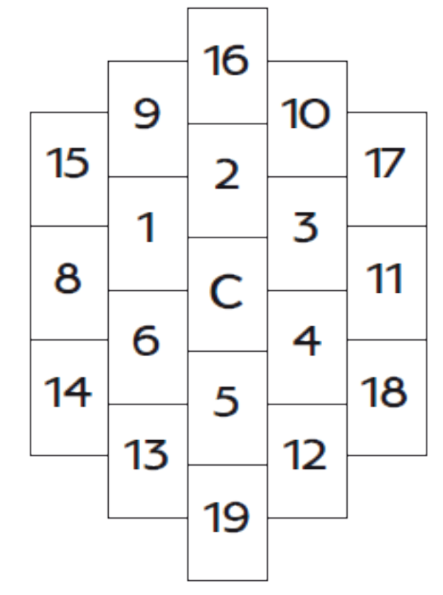
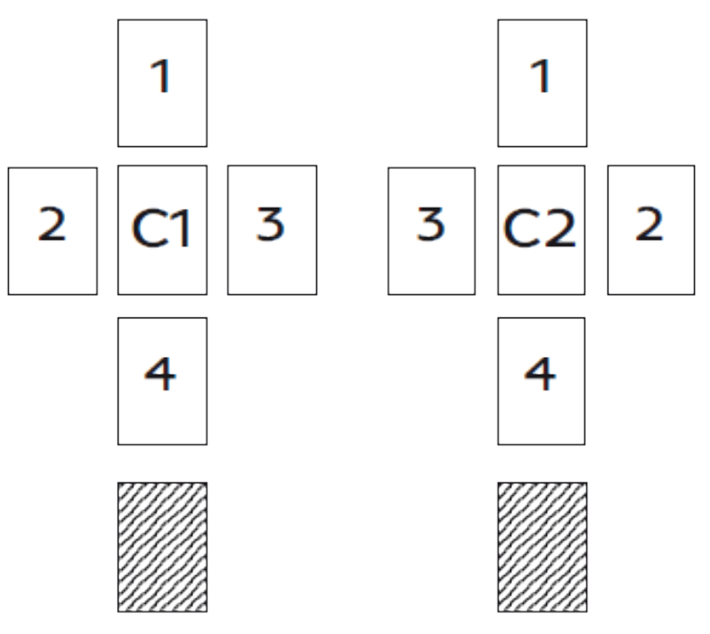

# Lenormand

## Подготовка

Язык карт – это образы. Читающий карты – не предсказатель, а переводчик (интерпретатор) образов.  
Гадание говорит о том, что должно случиться.  
Предсказание говорит о том, что может произойти, если следовать выбранному пути.  
Прежде чем начать работу нужно настроиться. Провести краткую медитацию, чтобы настроить свое подсознание на работу.  
У карт должно быть постоянное место.  
Желательно хранить карты завернутыми в кусок черной материи из натурального волокна (лучше всего шерсть).  
Хорошо, если будут подобраны (исходя из индивидуальных гороскопических данных) камень и трава.  
Во время расклада ничто не должно отвлекать: ни посторонние шумы, ни голоса, ни запахи.  
Перед перемешиванием карт забыть о всех проблемах, не относящихся к раскладу.  
Станьте чистым прозрачным хрусталем, готовым к восприятию информационного потока.  
Колода карт должна стать частью организма, почувствуйте ее как свой новый орган.  
Полностью сосредоточьтесь на интересующем вопросе и начните перемешивание карт.  
Мешайте до тех пор, пока не почувствуете, что карты заняли свое положение.  
Это может ощущаться как легкое сопротивление карт перемешиванию.  
Как только вы почувствовали этот момент, сразу начинайте раскладывать карты.  
Когда расклад сформирован, первым делом постарайтесь уловить вибрацию всего расклада в целом, не вдаваясь в детали отдельных карт.  
Прислушайтесь к себе, к своему телу.  
Какие у вас возникают чувства, ощущения, ассоциации?  
Постарайтесь увидеть картину ответа.  
После того как общее представление о раскладе у вас сформировалось, начинайте изучать расклад по порядку.  
Придумайте небольшой ритуал, который будет всегда сопровождать начало работы с колодой.  
Ритуал необходим для того, чтобы наше подсознание путем несложных физических манипуляций начало настройку на работу.  
Записывать каждый расклад и его интерпритацию, сверять с реальностью, если есть расхождения - найти причину.

## Карты

### 1 **ВСАДНИК** *(Девятка червей)* - новость, импульс

- Быстрая карта, молодой активный мужчина, велосипед, самокат, мопед, короткие поездки.
- Дом контактов, движения, активности, новостей, информации, контактов, общения.
- Бизнес: Новые идеи, решения, начинания, возможности.
- Отношения: Быстрое развитие отношений, поверхностное общение, секс по дружбе, новый поклонник, любовник.
- Личность: Умный, коммуникабельный, общительный, динамичный, независимый, путешественник, поддерживает большое количество связей.
- Кто, что: молодой мужчина, посетитель, гость, посредник, спортсмен, почтальон, курьер.
    Движение, начало, сообщение известие, посылка, телефонный, звонок, связь, коммуникация, общительность.
- Какой: быстрый, стремительный, ветреный, страстный, спортивный, устный.
- Что делать: начинать, двигаться, спешить извещать, привозить, ехать, продвигаться.
- Здоровье: Голова и лицо. Все системы связи в организме – кровеносная система, вегетативная нервная система.
    В целом – удовлетворительное самочувствие, но есть риск вирусных респираторных заболеваний и воздушно-капельных инфекций.  

### 2 **КЛЕВЕР** *(Шестерка бубен)* - надежда, шанс

- Карта: бытовая удача и радость, спокойного повседневного уютного счастья. Сокращает сроки - все случится быстрее, чем ожидали.
- Дом удачи, шансов, маленьких денег. Это дом счастливого случая.
- Бизнес: Интересные предложения. Шанс подзаработать. Необходимо приложить еще много усилий для развития дела.
- Отношения: Приятные радостные отношения. Второй шанс, примирение после ссоры. Легко встретились, легко разошлись.
- Личность: Чистосердечный, добросовестный, практичный, везунчик и оптимист с маленькими запросами, не опускает рук.
- Кто,что: подарок судьбы, возможности,удача, радость, благоволение, шанс, надежда, деньги, премия.
    Скидка, бонус, выгода, игрок, азарт, игра, небольшая прибыль, простота, талисман, амулет, травы.
- Какой: маленький, удачливый, быстротечный, оптимистичный, беззаботный, рискованный, простой, экономный, приятный, благоприятный.
- Что делать: радовать, давать шанс, нести удачу, рисковать, играть в азартные игры, выигрывать.
- Здоровье: Смягчает течение болезни. Совет воспользоваться услугами гомеопата или фитотерапевта.

### 3 **КОРАБЛЬ** *(Десятка пик)* - ветер перемен, путешествие, перемещения на дальние расстояния

- Карта: открывает новые горизонты в жизни, перспективы в делах, предвещает новые планы, проекты и грядущий успех.
    Карта дальнего пути, целенаправленного движения, пусть медленно, но верно, курс взят.
    Большие расстояния, что-то приходит издалека, из-за границы. Карта отдаляет желаемое, придется подождать.
- Дом поездок, движения, перемен, устремлений, удаления, тяги к дальним расстояниям,
    а также ностальгии, тоски, то, по чему человек тоскует и томится в разлуке.
- Бизнес: Торговля, коммерция, импорт / экспорт, деньги от логистики или путешествий. Большие прибыли.
- Отношения: выход отношений на новый уровень (первое совместное путешествие, переезд под одну крышу, предложение выйти замуж).
    Расставание с партнером. Отношения на расстоянии. Знакомство в дороге или на курорте.
- Личность: оптимист, уверен в себе, может повести за собой людей, не боится рисковать, целеустремленность, мужественность, активность,
    готовность преодолевать большие расстояния.
- Кто,что: Моряк. Иммигрант. Турагент. Путешественник. Движение. Прогресс. Транспорт. Автомобиль. Поездка. Командировка. Путешествие.
    Иностранец. Чужак. Заграница. Переезд. Изменения. Авантюризм. Разлука. Тоска.
- Какой: Заграничный. Заморский. Международный. Иностранный. Большой. Масштабный. Дальний. Перспективный. Дальновидный.
- Что делать: Двигаться. Везти. Уезжать. Открывать большие перспективы. Экспортировать.
- Здоровье: Символизирует кровеносную систему. Показывает изменение состояния, если нет неблагоприятных карт, в лучшую сторону.
    С картой ГРОБ, КОСА, КРЕСТ – может предвещать смерть.  

### 4 **Дом** *(Король червей)* - стабильность, семья

- Карта: домашний очаг, семейные дела, традиции и устои, связь с родом, частная жизнь, объект недвижимости, место проживания.
    Стабильность, безопасность, постоянство, душевное равновесие и уверенность в завтрашнем дне.
- Дом стабильности, семьи, а также близкого окружения и кровных родственников, всего частного и интимного пространства.
    Сигнификатор всех вопросов по недвижимости, земельным участкам, он касается всех имущественных вопросов.
- Бизнес: Устойчивое положение дел, стабильный доход. Терпение и труд помогут заложить крепкий фундамент и получить желаемый результат.
    Стабильная занятость. Работа в сфере недвижимости, строительства.
- Отношения: Желание создать семью, серьезные отношения, стабильный союз. Длительные и прочные отношения.
    Совместное проживание, приобретение жилья. Домашние бытовые хлопоты. Помощь и поддержка родных.
    При негативных картах - в отношения вмешиваются родственники, сильное влияние прошлой семьи.
- Личность: уверен в себе, крепко стоит на ногах, надежен, неизменяет себе, неспешен в делах и в принятии решений, предсказуем.
    Спокоен и его практически невозможно вывести из себя, домосед, плохо приспосабливается к переменам.
- Кто,что: Семья. Родственники. Отец. Уют. Домашние дела. Повседневные заботы. Имущество. Недвижимость. Собственность. Здание.
    Домовладелец. Риелтор. Арендодатель. Стабильность. Защита. Безопасность. Традиции. Устои. Родина.
- Какой: Надежный. Безопасный. Стабильный. Родной. Семейный. Уютный. Комфортный. Консервативный. Традиционный. Привычный. Частный.
- Что делать: Защищать. Стоять. Вмещать. Основывать. Обитать. Базироваться. Пребывать.
- Здоровье: Символизирует тело как место жительства души. Стабильность, консервативные методы лечения.

### 5 **ДЕРЕВО** *(Семерка червей)* - здоровье

- Карта: символ роста, плодородия, жизненной силы, стойкости, род, родственники, предки.
    Карта говорит о большом потенциале и владении нужными ресурсами, укоренении, развивитии и расширении.
    В позиции будущего – несомненный успех, в прошлом – прочная база, устойчивость позиций, в настоящем – стабильность.
- Дом здоровья, рода, корней, стойкости, медленного роста, долгосрочных проектов.
    Сигнификатор по вопросам здоровья и жизненных сил, медицины и врачей.
- Бизнес: Стабильный доход с перспективой роста. Уверенность в завтрашнем дне. Успешное дело. Прочные позиции, основательность.
    Человек медленно, но верно наращивает свое благосостояние, имеет финансовые активы и получает проценты от вкладов.
- Отношения: Стабильный союз, крепкие узы, здоровые отношения. Связь с семьей, родом. Кармическая связь.
- Личность: Спокойный с флегматичным темпераментом, зрелостью и мудростью, надежен, но не способен реагировать в спонтанных ситуациях.
    Трудолюбив и ответственен, не бросает слов на ветер, серьезно относится к обещаниям, устоявшимся ценностям и традициям.
- Кто,что: Здоровье. Жизненные силы. Потенция. Жизнестойкость. Устойчивость. Традиции. Заземленность. Корни. Предки. Род. Генетика. Рост.
    Сила. Плодородие. Защита. Поддержка. Прочность. Выдержка. Лес. Врач. Целитель. Предок. Шаман.
- Какой: Крепкий Спокойный. Надежный. Терпеливый. Длительный. Природный. Естественный. Устойчивый. Стабильный.
- Что делать: Расти. Крепнуть. Выдерживать. Зреть. Укреплять. Укоренять.
- Здоровье: Крепкое здоровье. У организма есть внутренние силы справиться с любым недугом. Хороший иммунитет.

### 6 **ТУЧИ** *(Король треф)* - надвигающиеся неприятности

- Карта: неясность, плохие предчувствия и надвигающиеся проблемы.
    Негативная атмосфера и ощущение, что надвигаются проблемы. Переменчивость ситуации, замешательство.
    Плохое самочувствие, болезнь, из-за которой придется отменить свои планы.
- Дом сомнений, страхов, неуверенности, ненадежности, мутности. Неясности и изменчивости в худшую сторону. Непознанное и мистика.
    Показывает разочарование, расстройство, горести и слезы, затемнённую сторону жизни, страхи и сомнения.
- Бизнес: Нежелательный поворот событий, мутность и неясность. Шаткое положение, нет возможности и полномочий, чтобы повлиять на ситуацию.
    Задержки по выплатам. Трудности с деньгами. Непонимание реального положения дел по финансам. Сложности в трудоустройстве.
- Отношения: Грядет полоса испытаний чувств на прочность: ссоры, скандалы, выяснение отношений. Неясные намерения партнера.
    Партнер на взводе и в любой момент может разразиться скандал. Подозрение и недоверие в паре.
- Личность: нервный, беспокойный характер, настроение меняется по нескольку раз за день от радужно-оптимистичного до пост-апокалиптичного.
    Нерешителен, но порой действует решительно лишь по причине самодурства, поступки необдуманные и приносят только еще больше проблем.
- Кто,что: Форс-мажор. Кризис. Осложнения. Болезнь. Сомнения. Неуверенность. Замешательство. Смятение. Неопределенность. Угроза. Беспокойство.
    Слезы. Самообман. Плохое самочувствие, недомогание. Сожаления, обиды, страхи, разочарование, меланхолия. Дождь. Пелена. Туман, дым.
    Плохая видимость. Экс-партнер. Курильщик. Пьяница. Наркоман.
- Какой: Мрачный. Грустный. Нахмуренный. Нестабильный. Тревожный. Мутный. Двусмысленный. Путающий. Негативный. Нерешительный. Раздражительный.
- Что делать: Скрывать. Прятать. Нагнетать. Ухудшать. Хмуриться. Запутывать. Мутить воду.
- Здоровье: Начало затяжной болезни. Иногда символизирует тромбы, закупорки.

### 7 **ЗМЕЯ** *(Дама треф)* - зло или мудрость

- Карта: символ врага, который может нанести смертельный удар, предательство и коварство.
    Символ мудрости и тайного знания, медицины. Может указывать как на врача, так и на заболевание.
    Женщина, которая за спиной может строить козни и плести интриги.
- Дом злых намерений, коварства, предательства, подлости, неприятностей, осложнений, обходов и окольных путей, измен и секса.
- Бизнес: Зависть, предательство, интриги, подставы со стороны коллег, партнеров.
    Могут подсидеть и не остановятся ни перед чем, чтобы достичь своей цели. Нечестная конкуренция.
- Отношения: Страсть, вожделение и секс - не только фундамент в отношениях, но и побудительный мотив действий.
    Если Змея выпала рядом с Всадником - отношения будут бурные.
    Опасные связи. Сильное сексуальное желание. Раздор в паре из-за злословия или сплетен окружающих.
    Предательство, обман, измена, соперница. Шантаж и манипуляции.
- Личность: Умнее и мудрее других, к нему идут за советом, или же он хладнокровен, расчетлив и жесток.
    Не идет на поводу у эмоций и чувств, манипулятор, который может заставить плясать под свою дудку.
- Кто,что: Угроза. Болезнь. Тайный враг. Недоброжелатель. Соперница. Конкурент. Искушение. Соблазн. Коварство. Подлость.
    Измена. Ревность. Зависть. Интриги. Заговор. Магия. Мудрость. Женщина. Рептилия. Объезд. Шланг. Провода.
- Какой: Ядовитый. Опасный. Злобный. Скрытный. Сексуальный. Обманчивый. Соблазнительный. Двуличный. Лицемерный. Длинный. Извивающийся. Витиеватый.
- Что делать: Предавать. Изменять. Интриговать. Нападать. Манипулировать. Отравлять. Завораживать. Искушать. Извиваться. Жалить. Кусать.
- Здоровье: Благоприятное протекание болезьни. Применять интенсивную химиотерапию, в некоторых случаях – лечение ядом.

### 8 **ГРОБ** *(Девятка бубен)* - окончание

- Карта: окончание того, что уже отжило свое. Символ утраты, завершения, пустоты.
    Очень долгая по времени карта: долго, навсегда, никогда.
    Сигнификатор болезней , может указать и на физическую смерть человека, боль от потери, скорбь и траур.
    Гроб может указать на замкнутое пространство или некий предмет (ящик, шкаф, шкатулка, лифт, темная комната, шахта).
- Дом пустоты, окончания чего-то, печалей, болезней и застоя. Что должно окончится в загаданный период, то и попадет в этот дом.
- Бизнес: Бесперспективность. Развал предприятия. Финансовые потери. Неудачное завершение дела. Увольнение.
- Отношения: Обида, негатив в отношениях, чувства умерли. Отношения, обреченные на провал, болезненное расставание, развод.
- Личность: Таинственным характер, колючий проницательный взгляд. Унылый, грустеный, депрессивен, подавлен.
    Пессимист, отшельник, бесчувственный. Фаталист.
- Кто,что: Окончание. Утрата. Завершение. Отсутствие. Болезнь. Смерть. Кризис. Застой. Потеря. Долгий тяжелый период.
    Пессимизм. Болезнь. Страдания. Боль. Затворничество. Покой. Забвение. Трансформация. Ящик. Шкаф. Сейф. Патологоанатом. Наследство.
- Какой: Мрачный. Печальный. Тягостный. Депрессивный. Замкнутый. Ограниченный. Черный. Пустой.
- Что делать: Прекращать. Завершать. Вмещать. Преобразовывать Забывать. Молчать. Уходить.
- Здоровье: Крайне неблагоприятная карта, может предвещать летальный исход. И никакого самолечения, чтобы не «сыграть в ящик»!
    В некоторых случаях – совет лечиться в больнице или лечь на обследование в стационар.

### 9 **БУКЕТ** *(Дама пик)* - подарок

- Карта: радость, сюрприз, любые подарки, поздравления, торжественная встреча, свидание.
    Удовольствие от жизни, приятные события и встречи. Красота во всех ее формах.
    Женщина, ухоженная и симпатичная, которая следит за собой.
- Дом романтики, флирта, приглашений, подарков, праздника, красоты, радости и невесомой лёгкости бытия.
    Показывает, что является для человека праздником жизни, как он наслаждается и отдыхает.
- Бизнес: Удачный период. Выгодные контракты. Спонсоры. Увеличение доходов. Выгодные предложения.
    Успешность, премия, вознаграждение. Внимание и признательность от коллег, начальства.
- Отношения: Флирт. Заигрывание. Легкие приятные отношения. Внимание и любовь со стороны партнёра, гармоничные отношения.
    Получение подарка (+ Клевер). Предложение руки и сердца (+ Кольцо). Знакомство с родителями (+Дом или Дерево).
    Демонстрация симпатии и страсти (+ Змея).
- Личность: очарование, шарм, обаяние, обходительность, вежливость, любезность, эстетизм, щедрость, общительность,
    сентиментальности, романтизм, повышенная эмоциональность, склонность к поступкам на публику,
    веселый преуспевающий в жизни, оптимист.
- Кто,что: Подарок. Приглашение. Знаки внимания. Комплименты. Флирт. Симпатия. Праздник. Сюрприз. Хобби. Творчество.
    Духи. Косметика. Визажист. Дизайнер. Подруга. Гости. Благодарность. Признание. Благодарность.
- Какой: Праздничный. Благодарный. Нарядный. Красивый Романтичный. Творческий. Мимолетный. Вежливый Обходительный.
    Разнообразный. Очаровательный. Ухоженный. Приятный. Пахнущий.
- Что делать: Радовать. Поздравлять. Украшать. Приглашать. Дарить.
- Здоровье: Хорошее самочувствие. При болезни – предвещает скорое выздоровление.
    Совет использовать мягкие натуральные средства, например фитотерапию.

### 10 **КОСА** *(Валет бубен)* - разрушение, разрыв

- Карта: символ смерти, опасности, сбора урожая. Предупреждает об опасности, при этом неожиданной и резкой
    (несчастные случаи, травмы, аварии, нападение, конфликты), о действиях разрушительного характера и неожиданном завершении чего-то.
    Срочность - откладывать нельзя. Время пожинать то, что было посеяно ранее.
- Дом внезапных событий, скорости, опасности, травм, разделения, окончания цикла, резкого и болезненного завершения, потери.
- Бизнес: Разрыв договоренностей и связей. Потеря прибыли, большие траты, штрафы. Увольнение, сокращение.
    Риск получить травму на производстве. Столкновение с бандитами, налоговыми службами, ревизорами.
- Отношения: Натянутые отношения, проблемы и агрессия. Назревает конфликт, вплоть до рукоприкладства. Отторжение, разделение.
    Неожиданный разрыв отношений. Развод, раздел имущества.
    В сочетании с Сердце, Лилии, Рыбы - пылкость, страстность, накал эмоций и решительность.
- Личность: тяжелый характер, импульсивный, нервозный, агрессивный, вспыльчивый, злобный.
    В отношениях/общении - холодный, наглый, грубый и резкий. Очень ревнив и подозрителен, не доверчив.
    Решительный, любит риск, не боится меняться, духом соперничества, жажда власти, напор, наглость и агрессивность.
- Кто,что: Урожай. Неожиданность. Разрушение. Разрыв. Травма, порез. Авария, несчастный случай. Конфликт, агрессия. Поломка. Смерть.
    Нож, скальпель, ножницы, шприц. Хирург.
- Какой: Внезапный. Опасный. Болезненный. Острый. Жестокий. Решительный. Травмирующий. Быстрый.
- Что делать: Косить. Срубить. Отрезать. Отсекать. Разделять. Удалять. Жать. Отказывать. Завершать. Урезать.
- Здоровье: Необходимость срочного оперативного вмешательства. Физические и психологические травмы.

### 11 **МЕТЛА** *(Валет треф)* - конфликт

- Карта: символизирует наказание, страдание и очищение, говорит о повторяющихся действиях, то что происходит снова и снова: 
    регулярные ссоры, хронические заболевания в острой фазе, нервные тики, вредные привычки. Душевные терзания, нервозность.
    Может предвещать насыщенный период с общением, переговорами и физической активностью, когда человек успел множество дел.
- Дом дискуссий, переговоров, разговоров, ссор, конфликтов, драк, противоречий. Отсеивать лишнее. Повторяющиеся действий или событий.
- Бизнес: Ссора партнеров по бизнесу. Конфликт с начальником. Сокращение штата работников. Чистка рядов. Увольнения. Смена условий 
    или места работы. Выговор от начальника в очень резкой оскорбительной форме. Борьба с конкурентами. Материальный спор.
- Отношения: Отсутствие взаимопонимания, несчастный роман, серьезный скандал. Регулярные ссоры, злость, конфликты, душевный дискомфорт.
    С картами Змея, Лилии, Сердце, Всадник - страстный секс. С хорошими картами - очищение через выяснение отношений.
- Личность: нервный, дерганный, эмоционально неустойчивый. Ораторство, предприимчивость.
- Кто,что: Разговоры, дискуссии. Споры, разногласия, пререкания. Сплетни. Поспешные действия, неуравновешенность. Стресс. Конкуренция. 
    Соревновательность. Наказание, очищение. Штраф. Насилие. Оскорбления. Травмы, растяжения. Воспаление, температура. Возбуждение.
    Ярость. Страсть. Секс, спорт, баня. Нахал, грубиян.
- Какой: Импульсивный. Болтливый. Резкий. Проворный. Повторяющийся. Вспыльчивый. Напряженный. Нервозный. Страстный. Болезненный. Регулярный.
- Что делать: Очищать. Наказывать. Ругать. Бить. Спорить. Критиковать. Провоцировать. Обсуждать. Упражняться. Выяснять отношения.
- Здоровье: Заболевания нервной системы, проводящих путей. Бурное и опасное течение болезни.

### 12 **СОВЫ** *(Семерка бубен)* - думы

- Карта: магия, тайна, мистики, недоброжелатель. Человек опытный, мудрый, повышенные интеллектуальные способности, ясно видит все до мелочей,
    слышит любой шорох. Сдержанные разговоры, полезнуя информация, философское осмысление ситуации, глубокие размышления и медитации, опасения,
    депрессия, подавленность, суета и хлопоты.
- Дом коммуникации, советов, повседневных забот, волнения, мыслей, удвоения, пары.
- Бизнес: подумать или посоветоваться с более опытным по этой части человеком. Просчитать еще раз все сметы и все возможные ходы,
    лучше пока воздержаться от действий и принятия решения.
- Отношения: скука в отношениях, вихря эмоций нет. Один из партнеров может подавлять другого, чтобы его авторитет признавали.
- Личность: обособлен, напряжен и печален, задумчивый, замкнутый, стеснительный, с большим количеством комплексов, имеет большой опыт,
    житейскую мудрость, образован и начитан.
- Кто,что: Думы. Мудрость. Ученость. Очки, линзы Вещи камуфляжной расцветки. Пенсионеры. Пара людей. Родители. Бессонница. Слежка. Пересуды.
    Сомнения. Ночь. Познание. Магическое воздействие.
- Какой: Тревожный. Угрюмый. Бдительный. Настороженный. Сомневающийся. Нудный.
- Что делать: Советоваться. Обдумывать. Наблюдать. Высматривать. Осуждать. Летать.
- Здоровье: Даже если нет видимых признаков болезни – не поленитесь сдать анализы или пройти обследование.

### 13 **РЕБЕНОК** *(Валет пик)* - начало, доверие

- Карта является сигнификатором детей и всего, что с ними связано. Нечто на этапе становления, что потребует много внимания, сил и ресурсов.
- Дом детей, родительских отношений, начинаний наивности, неопытности. Говорит о всем маленьком, небольшом и новом.
- Бизнес: Дело, которое начинается с ноля. Человек взялся за дело, в котором не разбирается, он слишком самоуверен и совсем не подготовлен.
- Отношения: Новые знакомства. Новые контакты. Постепенное сближение с другим человеком. Романтические чистые отношения. Флирт. Наивность. Беременность.
- Личность: молодые люди, либо наивность, открытость, искренность, доброта, способность обучаться. Характер гибкий и коммуникабельный.
- Кто,что: Дети. Начало. Доверие. Беременность. Роды. Рост. Развитие. Новое начинание. Чистота, доверие. Детство. Молодость. Ребячество. Новичок. Ученик.
- Какой: Невинный. Искренний. Маленький. Неопытный. Незрелый. Зависимый. Беспечный. Инфантильный. Простой. Непринужденный. Беспечный. Наивный.Непосредственный. Доверчивый. Любознательный.
- Что делать: Играть. Начинать. Расти. Уменьшать. Обучаться. Зависеть. Доверять.
- Здоровье: Недоразвитие, несфор-мированность каких-либо функций или органов.

### 14 **ЛИСА** *(Девятка треф)* - обман

- Карта: символ обмана, хитрости, изворотливости, лукавства, соблазнительности и женской привлекательности
- Дом хитрости и неоплачиваемого труда, ложных целей, детального планирования, недоверия и осторожности.
- Бизнес: Работа на себя. Сфера торговли. Обман со стороны партнеров или коллег. Проверки на работе.Умение извлечь выгоду из любой ситуации. Поиски работы.
- Отношения: стараются заманить в ловушку, недоговоренности и обман. Корысть, обман, измена, использование партнера в своих целях.
- Личность: дипломатичен и обходителен, всегда преследует только свои интересы и в любой момент способен вывернутся из любых договоренностей. Действует обдуманно, стратег, просчитывает все ходы и выходы наперед, он гибок и решителен. шлейф из обманутых и покинутых любовниц разоренных деловых партнеров
- Кто,что: Хитрость. Ум. Изворотливость. Сообразительность. Тонкий просчет. Многоходовка. Подхалим. Соблазнение. Занятость. Предательство. Цепкий ум. Шпион. Детектив. Аферист. Мошенник. Недоброжелатель. Ловушка. Конкурент. Взятка. Хищник. Охота. Трикстер. Фокусник. Адвокат. Юрист. Журналист.
- Какой: Находчивый. Лукавый. Изворотливый. Неискренний. Корыстный. Гибкий. Проницательный. Нечестный. Умный. Яркий. Скользкий.Хитрый. Красный. Быстрый. Юркий. Ловкий. Сексуальный. Оригинальный. Креативный. Практичный. Предприимчивый. Решительный. Дерзкий.
- Что делать: Хитрить. Манипулировать. Обманывать. Выкручиваться. Интриговать. Изменять. Лгать. Красть. Охотиться. Добывать пропитание.
- Здоровье: Карта предупреждает о сложно диагностируемых заболеваниях; иногда может намекать на врачебную ошибку. В некоторых случаях предвещает повышение температуры.

### 15 **МЕДВЕДЬ** *(Десятка треф)* - покровительство, власть, сила

- Карта: символ могущества, власти, связан с темами защиты и доброты, авторитетный человек, который имеет влияние на ситуацию, позиция силы и властных полномочий, а также доступ и владение ресурсами, сила, хорошее самочувствие.
- Дом силы и власти, помощи, благородства и покровительства, а также второго мужчины.
- Бизнес: Прочное положение. Серьезный бизнес. Надежные партнеры. помощи влиятельного лица, поступления денег. Удачное время для покупки недвижимости и вложения капиталов.
- Отношения: Надежные устоявшиеся отношения, партнёру можно доверять. За таким мужем женщина будет как за каменной стеной. Страстные отношения.
- Личность: полон энергии, приветлив, но с железным характером. Он недоверчив, долго думает и раскачивается на какое-то дело, но если уж что-то делает, то это основательно и на века. отличительная черта благородство и широта души, а также склонность к царским жестам. Склад ума - аналитический, он может быть внешне холодным и немногословным, но в душе добрый, честный и мягкосердечный.
- Кто,что: Хозяин. Муж. Отец. Начальник. Босс. Чиновник, должностное лицо (судья, офицер и т.п.). Банкир. Финансы. Ресурсы. Питание.
- Какой: Властный. Сильный. Влиятельный. Опекающий. Великодушный. Старший. Сильный. Большой. Опасный. Ревнивый. Авторитетный. Тяжелый. Выносливый. Надежный.
- Что делать: Покровительствовать. Защищать. Помогать. Управлять. Доминировать. Накапливать. Набирать жир.
- Здоровье: Когда хотят подчеркнуть
силу, здоровье и выносливость, то говорят: «Силен, как
медведь». Эта карта указывает на способность спра-
виться с любым недугом за счет внутренних резервов
организма.

### 16 **ЗВЕЗДЫ** *(Шестерка червей)* - вдохновение, космический порядок

- Карта: символ мечтаний, планов, надежд и творческого вдохновения. Помощь высших сил, свет в конце тоннеля. Вера в свое предназначение, поиск своего пути.
- Дом творчества, вдохновения и интуиции, мечтаний, летания в облаках, фантазий, надежд, планов на будущее, та также это дом магии и астрологии.
- Бизнес: Далеко идущие планы, перспективное начало, говорит только об идеях, открытиях, перспективных разработках и ноу-хау. Новые проекты, получение новой работы или смена профессиональной ориентации. Планирование, смелые интересные проекты. Возможность подняться по социальной лестнице и стать заметным.
- Отношения: Духовное родство,совместные планы.Дружба.Творческие отношения. Нежность. Общение на расстоянии. Виртуальный роман. Идеализация отношений.
оторвались от реальности, не хотят думать о будущем, совершают поступки без расчета на то, где, например, они будут жить, если у них родится ребенок, их не смущает отсутствие финансовой возможности содержать даже самих себя - студенческий брак.
- Личность: натура чувствительная, возвышенная, увлекается астрологией, астрономией, наукой и техникой, имеет талант, необычные способности. Характер уравновешенный, восприимчивая и чувствительная натура. Вокруг него всегда много знакомых, но настоящих близких друзей у него не много.
- Кто,что: Надежды. Планы. Мечты. Цели. Идеалы. Искусство. Интуиция. Эзотерика. Магия. Множество. Череда событий. Интернет. Навигация, gps. Компас. Верное
направление. Ночь. Астрология. Судьба. Удача. Добрый знак. Отдаленная перспектива. Предопределение. Космический порядок.
- Какой: Творческий. Романтичный. Удаленный. Ясный. Известный. Космический. Возвышенный. Эфемерный. Оптимистичный. Успешный.
- Что делать: Мечтать. Планировать. Вдохновлять. Стремиться. Направлять. Прояснять. Освещать. Показывать. Определять курс. Прорицать. Визуализировать.
- Здоровье: Физиотерапия. Лечение магнитными и электрическими полями. Состояние здоровья – вполне удовлетворительное, при заболевании – перспектива скорого выздоровления.

### 17 **АИСТ** *(Дама червей)* - изменение

- Карта: символизируют перемены, обновления и изменения ситуации в лучшую сторону, связаны с идеей семьи, семейного гнезда и верности традициям.
говорит о изменении, пополнении, новом поступлении, а вот чего именно - смотрим окружающие карты. Карта, лежащая слева от Аиста, говорит о том, что будет меняться, а карта справа - какие перемены принесет Аист. С картой Крест - перемены глобальные и неизбежные.
- Дом обновлений, перемен, переезд, беременность. Карта в этом доме: если Ребенок и Рыбы - то беременность и изменение статуса человека на родителя; если карта Кольцо, то дело к свадьбе; если карта Якорь - то изменения в сфере работы; если карта Корабль - то или долгожданная поездка или покупка новой машины.
- Бизнес: говорит о новых идеях и возможностях. Может указывать на рост дохода, но в перспективе.
- Отношения: Перемены, новые знакомства. Шаг со стороны партнера, который повлечет за собой изменения. Беременность. Рядом с Домом - свое гнездо.
- Личность: заметная и приятная, честность, верность, приверженность идеалам, мягкость и дипломатичность, приспосабливается, гибкий характер, плотная связь с родителями и другими родственниками. Всегда в движении, не терпит скуки и рутины. Отзывчив и готов прийти на помощь в любое время.
- Кто,что: Перемены. Обновление. Традиции. Путешествия. Миграция. Доставка. Беременность. Роды. Верность. Семейственность.
- Какой: Перелетный. Залетный. Семейный. Заботливый. Высокий. Стройный. Длинноногий. Сезонный.
- Что делать: Путешествовать. Доставлять. Переезжать. Перемещаться. Возвращаться. Улучшать. Менять. Ухаживать.
- Здоровье: АИСТ появляется, когда должно произойти изменение состояния в лучшую сторону. Иногда может содержать намек поехать лечиться на курорт, «на воды». Смена обстановки, чистый воздух окажут исцеляющее действие.

### 18 **СОБАКА** *(Десятка червей)* - дружба, доверие

- Карта: символ верности, преданности, бескорыстной дружбы, доверия, надежности, служения, самоотверженности, помощи и защиты.
- Дом дружбы, преданности, бескорыстия, верности, доверия, союзников, показывает привязанности, постоянство и то, от чего никуда невозможно деться по вопросам нравственности и порядочности. Дом домашних животных.
- Бизнес: Надежные партнеры, доверенные лица. Все стабильно. Ситуация защищенности, выполнение обещаний. Дружественная атмосфера, коллектив, всегда есть к кому обратиться за помощью.
- Отношения: Верность и самоотверженность в любви, Отношения строятся на доверии, взаимной поддержке. Искренняя дружба, которая может перерасти в любовь.
может указывать на преданного поклонника или отношения, где один любит, а второй благосклонно принимает, ревность
- Личность: Друг или коллега от которого всегда можно ждать поддержку и помощь. Близкий знакомый, член семьи, муж или жена, наставник, советник или даже психотерапевт, врач, тот к кому Вы можете обратиться за помощью, кто Вас поддержит, кто останется, рядом несмотря ни на что.
- Кто,что: Друг. Компаньон. Союзник. Единомышленник. Побратим. Напарник. Последователь. Сын (подросток). Доверенное лицо. Полицейский. Охранник. Подписчики, те кто следуют за кем-то.
- Какой: Преданный. Дружелюбный. Надежный. Верный. Искренний. Простой. Терпеливый. Постоянный. Полезный. Бескорыстный. Угодливый.
- Что делать: Дружить. Помогать. Доверять. Поддерживать. Любить. Сотрудничать. Служить. Защищать. Подчиняться.
- Здоровье: Реабилитационные процессы, хорошее заживление ран. Совет использовать народные способы и естественные лекарства.

### 19 **БАШНЯ** *(Шестерка пик)* - оплот

- Карта: символ государственной власти, казенного дома, а также защищенности, иерархии, авторитета, директивы свыше, установленной системы и структуры, оплота, порядка, гарантий, одиночества, изолированности, заключения, устойчивого положения, возможности подняться выше, амбиций и высокой самооценки.
- Дом защищенности, изоляции, казенных учреждений, органов власти, официальности, карьеры и статуса, гос. бумаги, вопросы с официальностью и законностью.
По этому дому смотрят продвижение по службе и решение казённых вопросов.
- Бизнес: Прочное уверенное положение. Стабильность, регулярный доход, соц. гарантии. Работа в крупной корпорации, на режимном изолированном объекте, государственная служба, высокая должность. Все под контролем. Важно идти официальным путем и все делать «по белому». Обращение в официальные инстанции.Инвестиции, банковские накопления. Добротный бизнес. Долгосрочный проект.
- Отношения: Служебный роман. Официально зарегистрированные отношения. Брак по расчету. Партнеры с разницей в возрасте или в социальном положении. Расставание. Партнеры живут отдельно друг от друга, у каждого свой бюджет. Один из партнеров подавляет другого.
- Личность: Человек-одиночка, интроверт, убежденный холостяк, независим, уверенно стоит на ногах, имеет жесткие принципы, убеждения и взгляды, несгибаем, невозможно зажечь идеей как и надавить на жалость, нужно все обосновать, ответственен, общепризнанный авторитет, дальновиден, большие требования к жизни и к людям, одиночество и обособленность.
- Кто,что: Власть. Правительство. Политика. Казенный дом. Бюрократия. Чиновник. Гос. учреждение. Общественная организация. Школа. Больница. Офис. Место работы. Отель. Банк. Вокзал. Изоляция. Заточение. Одиночество. Граница. Корпорация. Гарантии. Фундамент, база. Расставание. Размежевание. Структура.Преимущество. Карьера.
- Какой: Стабильный. Надежный. Изолированный. Высокий. Высокомерный. Независимый. Авторитетный. Непреклонный. Устойчивый. Прочный. Строгий. Незыблемый. Структурированный. Поэтапный. Дальновидный («Высоко сижу, далеко гляжу»). Официальный. Государственный. Практичный.
- Что делать: Ограничивать. Регистрировать. Контролировать. Надзирать. Управлять. Служить. Защищать. Восходить. Стремиться. Соблюдать правила.
- Здоровье: Долголетие. Стабильность. В зависимости от окружающих карт, положение может стабилизироваться как на стадии болезни (хроническое заболевание), так и в состоянии здоровья.

### 20 **САД** *(Восьмерка пик)* - общество

- Карта: символ отдыха и общения в приятной компании. Карта означает общество, общественные места и публичные мероприятия, группы, организации,
клубы, соц. сети, все, что находится в общественном доступе, вне личной, частной зоны.
- Дом светской жизни, социальных связей, общественности, встреч и свиданий, показывает, как человек проявляется в светской жизни, его социальная активность, насколько он заинтересован в жизни общества.
- Бизнес: Деловые встречи и знакомства на презентациях и фуршетах, выставках. Расширение контактов, рост клиентской базы. Хорошая рекламная компания.
- Отношения: Люди на публике. Влияние друзей, общественности. Совместный отдых, прогулки, встречи. Флирт, большое количество знакомств.
- Личность: обаятельный, учтивый, галантный, привлекательный, следит за модой, идет в ногу со временем, имеет массу контактов и связей. Красноречив, общителен, всегда в центре внимания, тонкий эстетический вкус, любит природу и красивые пейзажи, светская львица, тусовщик, очень эгоцентричные люди.
- Кто,что:Публика. Общество. Группа. Праздник. Вечеринка. Сбор. Собрания. Общественные места. Выступление. Публика. Скопление народа. Развлечения. Досуг.
Отдых. Общественное мнение. Репутация. Социум. Тусовщик. Социальные сети. Интернет. Маркетинг. Связи с общественностью. Аудитория. СМИ. Реклама. Гуляния.
Встреча. Общение.
- Какой: Публичный. Социальный. Общественный. Приятный. Компанейский. Массовый. Светский.
- Что делать: Встречаться. Собираться. Рекламировать. Общаться. Выходить в люди. Делать публичным. Обнародывать. Открывать. Устраивать
празднинк. Тусоваться. Прогуливаться. Праздновать. Играть на публику.
- Здоровье: терапия в группах, с неблагоприятными картами причина заболевания в невротичности, склонности к истерии.

### 21 **ГОРА** *(Восьмерка треф)* - препятствие

- Карта: символ преграды, трудностей, недостижимых высот и опасностей, препятствие на пути к цели, для преодоления которого потребуется много сил и времени.
- Дом препятствий, задержек, нагрузок, блокад, обвинений, противников, трудностей и их преодоления, переезд и жизнь за границей.
Если в дом Горы попадает карта Письмо, то это говорит о проблемах в решении вопроса с документами.
Для человека проактивного этот дом говорит о поэтапном восхождении на вершину, достижениях и триумфах, о защите своей позиции и готовности следовать намеченным путем, несмотря ни на что. Но для человека с пассивной позицией дом Горы обозначает одни проблемы и препятствия.
- Бизнес: большие проблемы и сложности, крупная компания или конкурент диктует условия и прогибает под себя, соперничество с коллегами. Рядом с картой Медведь или Башня - препятствия со стороны контролирующих учреждений. Бесперспективная должность. Задержки в получении средств. Не стоит форсировать события, придется или выждать, или грамотно обойти преграду.
- Отношения: глухая стена непонимания. Холодность. Отчужденность. Отсутствие перспектив в отношениях. нет желаия искать компромисс
- Личность: замкнут и отстранён, отличается сухой практичностью, надавить ему на жалость или чувства невозможно, осторожен, пессимистичен, отрицательные жизненные установки, эгоистичный, властный, жестокий, сила, выносливость, упорство, авторитет, влияние, мстительный, собственное достоинство и могущество
- Кто,что: Проблема. Преграда. Препятствие. Тупик. Вызов. Бремя. Застой. Нагрузка. Блокировка. Блокада. Барьер. Завал. Задержки. Враг. Граница. Таможня. Отшельник. Альпинист. Геолог. Цели.
- Какой: Трудный. Тяжелый. Высокий. Неподвижный. Прочный. Стабильный. Упрямый. Упорный. Далекий. Удаленный. Заграничный. Холодный. Одинокий. Медленный.
Ригидный. Неподъемный. Амбициозный. Авторитетный. Догматичный.
- Что делать: Преодолевать. Преграждать. Мешать. Блокировать. Преодолевать. Ограничивать. Сопротивляться. Задерживать. Разделять. Брать высоту.
- Здоровье: препятствия на пути нормального функционирования организма: тромбы, спайки, закупорки и т. п. Рядом с ЛУНОЙ означает проблемы с деторождением.

### 22 **РАЗВИЛКА** *(Дама бубен)* - выбор

- Карта: символ выбора пути и свободы воли, проблемы выбора, неопределенность, неизвестность. При негативных картах хорошо подумать перед принятием решения. Кверенту придется много ездить, возможно он будет прокладывать путь и выбирать маршруты. Может говорить что чего-то два или удваивать сроки.
- Дом выбора, кризиса и раздвоенности. Если в дом попала карта Сердце, то выбор касается любовной сферы, если карта Кольцо, то обязательств.
- Бизнес: появление новых источников дохода, новое предложение по работе или подработке, смена работы, вида деятельности, профессии, многозадачность и многопрофильность. Альтернативные варианты развития, новые направления в бизнесе. Командировка. Сфера работы, связанная с посредничеством или дорогами.
Нерешительные клиенты и партнеры, из-за чего бизнес будет простаивать.
- Отношения: Нерешительность, сомнения, неопределенность. Выбор из нескольких партнёров. Решение оставаться ли в этих отношениях или уйти. Нестабильность. Неверность. Любовный треугольник. Все эти значения усиливаются рядом с картами Кольцо, Сердце, Дом, Змея. В позитиве - Совместное путешествие или ситуация принятия решения.
- Личность: Молодой, подвижный, мобильный, импульсивный, дипломатичный, при проблеме быстро соображает где можно обойти с наименьшими потерями. Любит перемещаться с места на места, передвигаться, он контактен, но независим, держится обособленно и идет своим путем. В негативе сомневающийся, нерешительный, сам не знает, чего хочет, не верит в свои силы, каждый шаг долго обдумывает и старается взвесить все за и против. В идеале занять нейтральную позицию, и нашим, и вашим, чтобы и волки сыты были и овцы целы,по этой причине воспринимается людьми как двуличный и лицемерный тип.
- Кто,что: Перекресток. Свобода воли. Варианты. Выбор. Распутье. Решение. Сомнение. Неопределённость. Многозначность. Поиск. Измена. Дорога. Посредник. Путь. Турист. Автостоп.
- Какой: Альтернативный. Раздвоенный. Двойственный. Двуличный. Нерешительный. Неуверенный.
- Что делать: Выбирать. Решаться. Колебаться. Запутаться. Блуждать. Заблудиться. Искать выход. Дрейфовать. Распылять силы. Ходить. Двурушничать. Сидеть на
двух стульях. Вести двойную жизнь.
- Здоровье: Неоднозначность диагноза. Течение заболевания зависит от адекватности выбранного лечения.

### 23 **КРЫСЫ** *(Семерка треф)* - потеря, фрустрация

- Карта: потери, жадность, корысть, прожорливость, нетерпеливость, заразные болезни, множество мелких проблем, неприятностей, бытовых неурядиц, порча имущества, рядом с картой Дом - поломки в доме, с картой Корабль - поломка автомобиля, Дерево - проблемы со здоровьем, травмы, человека что-то гложет и грызёт, слабые нервы или хроническая болезнь.
- Дом убытков, хаоса, разрухи, потерь и страхов (что-то грызет и гложет), физический или моральный вред, кража, болезнь, хлопоты и суета, жадность, патологическая экономия,стремление накапливать вещи нужные и ненужные. Какая карта попадет в дом Крыс, в той сфере и стоит ждать потери.
В позитиве плодовитость и способность к кропотливой работе (вгрызание в суть, прогрызание).
- Бизнес: В позитиве - работа в команде, требующая внимательности и въедливости. Потеря денег, проблемы с бухгалтерией, мошенничество, махинации.
Скрытые враги, происки конкурентов и нечистоплотных партнеров, которые за спиной пытаются урвать кусок.
- Отношения: Пренебрежение интересами партнера преследование своих мелких корыстных интересов, не упустит возможности подставить и обокрасть, эротизм и сексуальность в самых «грязных» формах, сексуальные расстройства и извращения, венерические и кожные заболевания.
- Личность: неприятный, вызывающий настороженность, пессимистично настроен, нудит, тянет энергию всеми способами, вампир, берёт больше чем дает сам.
- Кто,что: Болезнь. Потеря. Кража. Хищение. Растраты. Антисанитария. Компания, группа. Страхи, фобии. Мусор. Паразиты. Истощение. Стресс. Деградация. Разруха. Вор.
- Какой: Вредный. Подлый. Порочный. Извращенный. Неприятный. Нищий. Беспокойный. Заразный. Грязный. Раздражительный. Корыстный. Распущенный. Скрупулёзный.
- Что делать: Грызть. Потреблять. Сокращать. Уменьшать. Воровать. Обманывать. Разрушать. Портить. Работать в команде.
- Здоровье: Тяжелое течение заболевания, осложнения, необратимые изменения в организме. Может стать сигналом желудочных или пищеварительных проблем. Заболевание может принять тяжелую хроническую форму.

### 24 **СЕРДЦЕ** *(Валет червей)* - эмоции, любовь, счастье

- Карта: эмоции, романтика, любовь, поддержку, помощь, сердечное участие, душевная тяга к чему-то или кому-то, прикипеть всем сердцем, показывает то, что нам дорого и близко, удар в сердце, глубокие переживания, чувство вины обида, ревность, эмоциональный раздрай и разобранность
- Дом любви и эмоций, то к чему привязан всей душой.
- Бизнес: Повышенный эмоциональный фон, работа по сердцу, занят любимым делом. Благотворительность. Успешное развитие дел. Помощь в работе по связям и личному расположению. Решения принимаются под влиянием эмоций. Получении денег или имущества, которое принадлежит по праву.
- Отношения: Начало романтической связи, новое знакомство, единение душ, трепет сердца, волнение, любовь, ненависть, искренность, верность, преданность, привязанности, обновление чувств, роман, о котором с грустью в сердце вспоминают в течение многих лет.
- Личность: сердечный, больше отдает, чем получает, хорошо тогда, когда хорошо другим, отзывчивый, терпеливый, заботливый, понимающий, эмпатия, открытый, искренний, нежный, ласковый, преданный, верный, наивен, часто обманывается в любви, фрустрация, опустошение и депрессия.
- Кто,что: Любовь. Чувства. Эмпатия. Привязанность. Радость. Страсть. Храбрость. Влечение. Гармония. Близость
- Какой: Искренний. Сердечный. Понимающий. Нежный. Добрый. Романтичный. Волнительный.
- Что делать: Любить. Принимать. Симпатизировать. Сочувствовать. Сопереживать. Флиртовать. Желать.
- Здоровье: сердечно-сосудистая система, в сочетаниях с неблагоприятными картами может означать нарушения сердечной деятельности или «болезни от удовольствий».

### 25 **КОЛЬЦО** *(Туз треф)* - брак, соглашение

- Карта: символ союза, брачные и деловые соглашения, отношения, договоренности, обязанности, обязательства, брак, непрерывность, вечность, стабильность,
гармония, целостность, единение, повторение и цикличность, рутина, подарок, драгоценности и украшения, связанные обязательства и ограничения.
- Дом соглашений, соединений, связей, договоров, обязательств, партнерства, союзничества, браки, разводы, договора, брачные контракты, бег по кругу.
Обязательства по закону, то что связывает и сковывает, если в доме Креста по судьбе, в доме Собаки из чувства долга и по совести.
- Бизнес: Все стабильно, регламентировано, дела идут своим чередом, коллектив - сплоченная команда. Надежные партнеры, совместное предприятие. Заключение контрактов и соглашений, получение должности.
- Отношения: Новые серьезные знакомства. Верность, преданность партнера. Брак, крепкие узы, совместное ведение дел. Появление связывающего звена: совместное проживание, взятие кредита на общие покупки.
- Личность: Элегантный, ухоженный, заботится о том какое впечатление он произведет, о своем социальном статусе, заслуживает доверия, надежен, женат, деловой партнер, спокойный, терпеливый, стремиться к гармонии.
- Кто,что: Союз. Соглашение. Партнерство. Обещание. Контракт. Равновесие. Долг. Привязанность. Помолвка. Брак. Связь.Узы. Подарки. Украшения. Ценности.
- Какой: Верный. Преданный. Обязательный. Закольцованный. Повторяющийся. Цикличный.
- Что делать: Держать слово. Обещать. Брать на себя обязательства. Давать клятву. Принадлежность к чему-то или кому-то. Объединять. Заключать договор.
Завершать цикл. Взаимодействовать. Повторяться. Подтверждать. Предлагать руку и сердце. Ходить по кругу. Окружить. Ограничить. Связать.
- Здоровье: Серьезно и пунктуально выполняйте все предписания и рекомендациям врача. Заболевание не будет продолжительным и не даст осложнений. Курс лечения, который нужно пройти от и до.

### 26 **КНИГА** *(Десятка бубен)* - тайна, учение

- Карта: символ тайны, мудрости, у Кверента мало информации по данному вопросу, надо навести справки или проконсультироваться с экспертом, литературная деятельность, писательство, творчество, обучение и преподавание. Приобщению к некоему учению, познанию тайны. Обработка информации, электронный носитель.
- Дом тайного, сокрытого, обучения, образования, тайн, секретов, оккультизма. Насколько человек стремится к самообразованию. Что-то скрывает либо сам Кверент,либо от него что-то скрывают.
- Бизнес: необходимость глубокого анализа и изучения, надо поднять свой профессиональный уровень и пройти курсы повышения квалификации, продолжить обучение. Офисная работа с информацией, исследованиями, бухгалтерский учет, с книгами, рефератами, докладами, секретные разработки, шпионаж.
- Отношения: Тайные отношения. Секреты от партнера, закрытость и недопонимание между партнерами. Тайный роман или отношения с очень сложным и замкнутым человеком. Встречи по интересам, основанные на интеллектуальном родстве.
- Личность: хорошо образован, умный, эрудированный, не общительный, замкнут, себе на уме, богатая внутренняя жизнь, умеет сам себя развлечь, много читает, таинственность и загадка, его сложно прозондировать и предугадать.
- Кто,что: Образование. Учеба. Знания. Молчание. Данные. Опыт. Книги. Документы. Факты. Исследования. Проект. Анализ. Библиотека. Учитель. Редактор. Писатель. Бухгалтер. Ноутбук.
- Какой: Тайный. Секретный. Скрытный. Сдержанный. Мудрый. Замкнутый. Загадочный.
- Что делать: Обучать. Узнавать. Читать. Помнить. Преподавать. Знакомиться. Издавать. Скрывать.
- Здоровье: А вот в отношении во-просов здоровья эту карту можно назвать плохой. Она
предупреждает о скрытых формах протекания забо-
левания, сложностях с постановкой точного диагноза.
Иногда указывает на проблемы со зрением.

### 27 **ПИСЬМО** *(Семерка пик)* - новости, официальные документы

- Карта: получение посланий и новостей, бумаги, документы, корреспонденция, журналы, выписки, счета и деловое официальное известие
- Дом писем, сообщений, бумаг и документов, корреспонденции и общения по переписке, поверхностная информация, реклама, оповещения, рассылка, спам, оформления документов, заполнения бланков и умения письменно излагать свои мысли.
- Бизнес: Работа с документацией, корреспонденцией, обработкой информации, документооборот. Налаживание контактов. Деловая переписка, выставление счета. Бумажная волокита, работа с юридическими документами, казенными бумагами, получение разрешений, лицензий. В плане финансов - дополнительные заработки, «зарплата в конверте» или какие-то пособия, дополнительные выплаты, субсидии. Чеки, векселя, акции, бюрократия, схемы по расширению предприятия, контракт, отчеты, договора, сертификаты, лицензии.
- Отношения: Желание больше общаться. Получение известий от любимого человека. Роман по переписке, знакомства в интернете,отношения на расстоянии. Тайные встречи тет-а-тет, конфиденциальное, мимолетные романы.
- Личность: общительный, легкий и контактный, он любит познавать, учиться, очень любопытен, стремительный в движениях, активный и неспокойный, формальное общение, красноречив, заговаривает зубы, без глубины познаний.
- Кто,что: Документы. Бумаги. Письма. Факс. СМС. Извещения. Уведомления, счета, выписки. Подтверждение. Разрешение. Сертификат, лицензия. Отчеты, результаты. Договор. Контракт. Коммуникация. Новости. Открытка. Визитка. Газеты, журналы. Телеграмма, бандероль, посылка. Карты. Чеки, счета, меню. Новости
Информация, почтальон. Писатель. Блоггер.
- Какой: Официальный. Деловой. Документальный. Печатный. Бюрократический. Письменный.
- Что делать: Оформлять. Писать. Получать. Отправлять. Общаться. Рекламировать. Извещать. Документировать.
- Здоровье: Нейтральная карта. В некоторых случаях бывает связана с определенными функциями работы мозга, но это редкие частные случаи.

### 28 **МУЖЧИНА** *(Туз червей)* - карта спрашивающего мужчины

- Карта: сигнификатор Кверента если он мужчина или карта важного мужчины если Кверент женьщина. Янская активная энергия, свет, активность, смелость, напористость, агрессия, сознание и логика, все зависит от самого Кверента, если он мужчина; если женщина - от ее партнера.
- Дом Кверента-мужчины - его характеристика, самооценка и качества, в целом в раскладе - активная деятельная позиция, готовность конкурировать.
Для Кверента-женщины дом партнерства как такового, либо наличие партнера, либо перспективы на отношения.
- Бизнес: Активное влияние мужчины. Новый партнер. Активная позиция, независимость, агрессивное пробивное поведение. Захват новых территорий, экспансия. Ответственность за дело, руководство. Начальник или коллега по работе. Финансовое положение стабильное. Приход денег от мужчины.
- Отношения: Новое знакомство. Активная роль партнера. Сильное влияние мужчины. Мужчина ответственен в отношениях, инициатива исходит от него, старается держать всё под контролем и доминировать, отношения держаться за счет мужчины, благодаря его усилиям. Соперник. В отношения вмешивается неким мужчина.
- Личность: активность, созидательная позиция, ответственность, сила, мужественность, настоять на своем, заполучить желаемое, не пасовать, ведет активную интересную жизнь, спорт, охота, рыбалка.
- Кто,что: Кверент. Супруг. Партнер. Настойчивость. Упорство.
- Какой: Мужественный. Сильный. Аналитический. Активный. Янский. Волевой. Напористый. Агрессивный.
- Что делать: Проявлять активность. Доминировать. Начинать.
- Здоровье: Для мужчины – проблемы половой сферы. Для женщины – нарушение гормонального баланса.

### 29 **ЖЕНЩИНА** *(Туз пик)* - карта спрашивающей женщины

- Карта: сигнификатор Кверентки, если Кверент мужчина - то это важная женщина в контексте его вопроса (любимая, жена, мать, дочь, начальница, сестра), главная женщина в раскладе. Иньская пассивная энергия, с принятием, мягкостью, нежность, сочувствие, ласка и забота, спокойствие, связана с Луной, подсознанием и интуицией.
- Дом Кверента-женщины описывает ее характеристики, самооценку и качества, и также пассивную позицию принятия. Для Кверента-мужчины дом партнерства как такового, либо партнерши, либо перспективы на отношения.
- Бизнес: Многое будет зависеть от женщины. Спокойный период пониженной активности, важнее сохранить то, что есть, а не добиваться новых результатов, положиться на интуицию и чутье. Начальница или коллега по работе. Приход денег от женщины.
- Отношения: Если карта Женщина не используется в качестве сигинификатора,то ее значение сильно зависит от окружающих карт. Один из партнеров играет роль заботливой мамы все прощающей своему шаловливому ребенку. Самоутверждение через опеку, возможна гиперопека. В отношения вмешивается некая женщина: мать или соперница. Новое знакомство. Важная женщина войдет в жизнь Кверента. Отношения зависят от женщины.
- Личность: женщина от кончиков ногтей на ногах до кончиков волос, миловидная, женственная, с большими бедрами и полной грудью. По характеру мягкая, нежная, любит домашние дела, хорошая хозяйка. Если карта Женщина выпала как карта личности для мужчины, это значит, что мужчина мягкий, у него много женских качеств, мужественности в нём нет. Если Вы ищите того, за кем будете как за каменной стеной» - это не о нём.
- Кто,что: Кверентка. Супруга. Невеста. Дочь. Мать. Подруга. Любовница. Коллега.
- Какой: Женственная. Иньская. Мягкая. Ведомая. Гибкая. Интуитивная. Пассивная. Робкая. Добрая. Спокойная. Сентиментальная.
- Что делать: Заботиться. Подчиняться. Адаптироваться. Получать. Принимать. Ожидать. Воспринимать. Взращивать.
- Здоровье: Для женщины – проблемы половой сферы. Для мужчины – нарушение гормонального баланса.

### 30 **ЛИЛИЯ** *(Король пик)* - добродетель

- Карта: символ высокого положения человека, достижений и признания со стороны социума в виде привилегий и регалий. Давность чего-то, люди в возрасте.
Неспешное развитие, но длительный эффект. Секс, невинность, девственность, в негативе - холодность и проблемы в сексуальной сфере.
- Дом это дом гармонии, спокойствия, положительных событий, семьи и семейных связей, наследства и фамильных регалий, власти, авторитета, признания и почета, социальных достижений, честности. Воспитание Кверента, манеры, поведение в обществе, знание этикета и хорошего тона, насколько он культурен и
уважителен к окружающим, черты аристократии и благородство души, насколько гармонично и полно развита его личность. Если запрос Кверента касается отношений, то этот дом будет отвечать за сексуальность, а если работы или семейных вопросов - то достижения и наследство.
- Бизнес: Честность и благородство, хорошая высокая должность, занимаетесь своим делом, имеете к нему незаурядные способности и можете построить хорошую карьеру, стать авторитетом или знаменитостью по своей сфере. Хороший ход событий в бизнесе, карьере (поддержка, протекция, продвижении по службе); поступлению денег (повышение зарплаты, финансирование, гранты, спонсорская помощь, меценат). Большой стаж и опыт, одобрение и похвала от начальства.
Достижения. Почести. Высокий статус. Верный выбор направления, значимый проект. Покровительство. Стабильное комфортное положение. Медленно накапливающиеся финансы.
- Отношения: Долгий союз, зрелые отношения. Ваш любимый боготворит вас, вы для него идеал и мечта. Вас ждут красивые отношения, Романтизм, экзальтированные
эмоции, восторженность чувств, красивые ухаживания, полное взаимопонимание в паре, хороший секс как высшее проявление любви либо платонические отношения или духовная любвь, возвышенное отношение к партнеру, идеализация. Сексуальные отношения, но в отличие от карты Змея или Метла, когда страсть и спортивный интерес и все чисто на физическом уровне, по Лилиям секс утонченный, с верностью избранному партнеру. Искренность. Высокие духовные отношения. Примирение, гармония. Отношения с партнером старше по возрасту или выше по социальному положению.
- Личность: благородный, честный, с высокими нравственными принципами, старомодный и чопорный, много внимания внешнему впечатлению, чувствительный, нежный, внимательный к окружающим, опытный, зрелые рассуждения о жизни, помогает и поддерживает, оказывает покровительство, не причинит вреда, ни случайно, ни умышленно, он умен, справедлив, искренен и честен, его слова не расходятся с делом, не отступит и не смалодушничает.
- Кто,что: Достижения. Честь. Возраст. Зима. Голубая кровь. Власть. Слава. Высокое положение. Правосудие. Гармония. Благополучие. Зона комфорта. Мир.
Покой. Равновесие. Покровитель. Доктор. Юрист. Наставник. Благотворительность. Пенсия. Истеблишмент. Идеалы. Роскошь. Избирательность. Непорочность.
- Какой: Привилегированный. Добродетельный. Чистый. Искренний. Интимный. Сексуальный. Аристократичный. Милосердный. Благородный. Честный. Верный. Спокойный. Зрелый. Белый. Мудрый. Пожилой. Знатный. Наследный. Преемственный. Традиционный. Экзальтированный. Притягательный.
- Что делать: Покровительствовать. Заботиться. Поддерживать.
- Здоровье: Успешное излечение. Но иногда может предупреждать об опасности отравления.

### 31 **СОЛНЦЕ** *(Туз бубен)* - удача, оптимизм

- Карта: самая сильная положительная карта в колоде, предвещает успех, удачу, известность, символ жизни, источник света и тепла, жизненной силы, божественной энергии, все становится ясным и очевидным, креативность, достижение цели, хорошее самочувствие и счастливое стечение обстоятельств.
- Дом успеха, радости, счастья, энергии, стабилизации, а также запас жизненных сил Кверента. Это Дом успеха и свершений, всего, что удаётся в жизни. По этому дому идут ясные осознанные цели, так и в общем ясность для какого-то дела (пролить свет). Дом Солнца показывает насколько Кверент счастлив, насколько
успешен в делах, благосклонна ли ему Фортуна, насколько энергичен и полон сил, или наоборот потух и погас, а также что дате подъем творческих сил и
энергии; есть ли у Кверента потребность быть в центре внимания, уровень амбиций, эгоцентризма, каковы его творческие способности.
- Бизнес: Успех в делах. Хорошая карьера. Перспективная работа. Надежный источник заработка. Процветание фирмы. Работа, которая приносит радость. Хороший коллектив. Благоприятный период для начала новых дел, запуска больших проектов, подписания долгосрочных контрактов и инвестиций, Процветание, самореализация, признание, популярность, лидерство. Активность, проявления янских качеств. Выгодные сделки. Финансовое благополучие.
- Отношения: Период искренних душевных отношения. Все планы и задумки относительно человека, которого мы любим свершатся. Карта Солнце предвестник того, что пара останется вместе. Между ними есть любовь и их отношения будут развиваться дальше. С такими страстными картами как Змея, Лилии и Сердце Солнце будет указывать на страстные бурные отношения. От этой пары буквально летят искры электрического тока. Между супругами душевные хорошие теплые отношения. Счастливая семья. Здесь нет места обману или эгоизму. Также здесь не минутное увлечение под действием силы страсти. В этих отношениях есть зрелые чувства,
серьезные намерения. Отношения гармоничные и ясные, никаких недомолвок и тайн. Люди ясно видят свое совместное будущее, строят планы на дальнейшую жизнь. Партнер очень искренен и может доказать свои чувства не только на словах, но и на деле. Если рядом выпала карта Сердце , то человек видит себя только рядом с Вами. Яркие, эмоциональные, страстные отношения. Радость, удовольствие. Искренние теплые чувства. При негативе - эгоизм партнера.
- Личность: Солнце дает человеку такие характеристики как: оптимизм, дружелюбный нрав, обаяние, великодушие, щедрость, яркая внешность. Человек буквально светится изнутри и всегда выделяется из толпы, очень магнетичен, к нему тянутся люди, т.к. он одним своим видом повышает настроение. Это море обаяния и улыбок. Стремление созидать и одаривать помогает собирать вокруг себя людей, а яркая и сильная натура делает их лидерами от природы. Имея ярко выраженную творческую активность, человек не может жить спокойно, не передав свой талант. Методами передачи могут быть как в творческих профессиях, так и в педагогике, или в роли уважаемого человека, который имеет авторитет и влияние. Сильна воля, энергичность все это помогает добиваться поставленных целей. В негативном проявлении человеку требуется одобрение состороны, нужна публика, а если он не в силах его получить, то привлекает внимание к собственной персоне любой ценой.
- Кто,что: Успех. Триумф. Рассвет. Радость. Признание. Энергия. Вдохновение. Сила. Творчество. Здоровье. Харизма. Лидер. Электричество. Юг. Лето. Ян. Эгоист. Самореализация. Слава. Призвание. Талант.
- Какой: Успешный. Яркий. Оптимистичный. Искренний. Благополучный. Теплый. Светлый. Активный. Притягательный. Привлекательный. Знаменитый.
- Что делать: Освещать. Вносить ясность. Процветать. Достигать. Организовывать. Победить. Греть. Восстановить силы. Сиять.
- Здоровье: Прекрасное здоровье или успешное излечение. Иногда обозначает биоэнергетическое целительство.

### 32 **ЛУНА** *(Восьмерка червей)* - традиции, честь

- Карта: связана с психикой, чувствительностью, воображением, снами. Также луна связана с подсознанием и интуицией, внутренним знанием, иррациональным, тайным и иллюзорным. Карта говорит о повышенной эмоциональности, о том, что вопрос для Кверента волнительный. Лунные циклы сопоставимы с женскими циклами и часто карта показывает женский аспект, сильное влияние матери, бабушки. Часто карта говорит о сроке в один месяц.
- Дом нестабильности, переменчивости, сомнений, переживаний, всего, что задевает наши эмоции. Экстрасенсорные способности. Дом интуиции, души, интимности, семьи, эмоций, пассивности, восприимчивости, адаптации, снов, инстинктов, материнства, рода. Этот дом касается всего, что мы чувствуем, что нас задевает. Все, что нас волнует, за что мы переживаем и что способно вывести из эмоционального равновесия - упадет в этот дом. По дому Луны также, как и по дому Солнца идет слава и признание. Но если дом Солнца стабилен, то дом Луны нестабилен и непостоянен, зависит от многих факторов, цикличен и имеет волнообразное течение с приливами и отливами. И то как человек отдыхает, что его питает и помогает восстанавливаться. Бессонница, страхи, переживания,
душевные муки и сомнения в самом себе также идут по этому дому, если туда попали качества, активирующую эту лунную сторону.
- Бизнес: удовлетворение первичных потребностей - еда, вода, сон. На жизнь хватать будет. Нестабильность в финансах, сезонная цикличность, прилив и отлив.
- Отношения: В личных отношениях значение карты Луна зависит от других карт расклада. Она может говорит, как о покое, уюте, домашнем очаге, где можно отдохнуть и восстановить силы после рабочего дня, заботу со стороны близких и родни. Ваш любимый хочет простого человеческого счастья, отдыха, спокойного
совместного досуга. Он полностью уверен в ваших отношениях, ему комфортно и спокойно, он хочет заботиться и опекать вас. Забота. Беременность. Влияние женщины. В негативном аспекте Луна говорит о потребительском отношении к людям, нестабильности, страхах, переменчивости, человек не знает, чего ждать от партнёра в следующий момент. Он сильно зависим эмоционально, вплоть до физической зависимости, старается подладиться под партнера, под его перепады настроения, угодить. Глубокая эмоциональная привязанность.
- Личность: Карта Луна описывает человека интуитивного, душевного, романтичного. Он часто витает в облаках, строит фантазийные планы, оторванные от реальности, мечтает, может отличаться меланхолией, задумчивостью, грустью. Обычно такой человек отзывчив и с удовольствием заботится о других, входит в их положение. Большая потребность в гармонии. Он подвержен влиянию извне и сильно реагирует как на перепады погоды, так и на перепады в настроении других людей. Такой человек может быть одарен музыкальным слухом или тонким вкусом, художественным восприятием, артистизмом из-за умения подражать и легко перестраиваться, или же магическими способностями, которые могут возникать спонтанно и пугать его самого.
- Кто,что: Перемены. Воображение. Вдохновение. Переживания. Эмоции. Ночь. Магия. Подсознание. Сны. Психология. Менструация. Беременность. Материнство.
Нестабильность. Экстрасенсорные способности. Инстинкты.
- Какой: Интуитивный. Чувствительный. Цикличный, Нестабильный. Изменчивый. Женское начало. Творческий. Романтичный. Интимный. Мягкий. Капризный. Восприимчивый. Влажный. Темный. Пугливый. Меланхоличный.
- Что делать: Изменяться. Адаптироваться. Повторяться.
- Здоровье: распределение жидкостей в организме. Почки, мочеполовая система. Иногда может предупреждать о наличии гинекологического заболевания.

### 33 **КЛЮЧ** *(Восьмерка бубен)* - открытие, новые начинания

- Карта: символ открытия и власти, обладания чем-то важным. Часто ключ символизирует инструмент для достижения цели, как Золотой ключик у Буратино. Также это отражено в речи: ключик от сердца, ключ к успеху. Карта говорит о правильном решении, найденном выходе и движении к цели. Рядом с другой картой - указание на то, что это нечто ключевое (Мужчина-Ключ - важный человек в контексте запроса). Ключом можно как открыть что-то, так и закрыть, но чаще всего карта отыгрывается в позитивном русле открывая новые возможности. Карта указывает на важный поворотный момент в жизни. Стоит открыться навстречу новым
возможностям. Раскрытие тайны, правильный выбор, решение проблемы, выход из ситуации, новые возможности. При сложных ситуациях я смотрю в БРЛ в какой дом
выпала карта Ключ и какая карта выпала в его 33 доме - и читаю эти карты как возможное решение текущей проблемы. Рядом с Бланкой - клюк к успеху уже в руках у Кверента.
- Дом решения проблем, позиция совета как получить ключ к решению проблемы. Дом решения, разгадки, очевидности, ресурсов, доступа, секрета, уверенности в своих силах, эрудиции, интеллекта, надежности, осознания, открытости или закрытости. Этот дом показывает, как человек находит ключ, разгадку и отмычку для своей проблемы, может ли Кверент брать на себя ответственность или стремиться переложить инициативу на других, делает ли выводы, какие-то открытия, как применяет их в жизни. Карта, которая выпадет в доме Ключа расскажет «как?», а сама карта Ключ, попавшая в какой-то дом, расскажет «где?».
Например, если карта Мужчина выпадает в доме ключа, а сама карта Ключ выпадет в доме Медведя, то - мужчина поможет решить проблему через свои связи,
свой авторитет в этом деле. Если в доме Ключа выпала карта Лиса, а сам Ключ в доме Змеи - хитростью и продуманностью решу вопрос со своей соперницей.
Может не много смутить кардинально разные ключевые понятия, например, «открытость или закрытость», но это заключено в самой символике ключа, и что именно он обозначает надо смотреть по другим картам, которые с ним связаны. Например, если Ключ выпал в доме Книги или Гроба, то речь идет явно о закрытии информации. А если ключ выпал в доме Звезд или Солнца,то о прояснении, на что-то прольется свет, что-то станет очевидным, ясным и понятным, покровы тайны спадут.
- Бизнес: Стоит ожидать выгодных предложений по работе, удачный период, можете блеснуть своими профессиональными навыками и получить повышение. Работа - призвание, Нет опасности увольнения или сокращения. У Вас новый удачный проект, требующий нестандартного подхода. Новые передовые технологии. Научный прорыв. Мозговой штурм при решении бизнес вопроса. В плане денег карта Ключ также дает хороший прогноз - Вы найдете способ для заработка. Хорошая подработка или выгодное вложение денег. Новые перспективные проекты. Выгодные связи. Карьерный рост. Ресурс для успешного решения проблем. Профессионализм Кверента и его контроль по текущим вопросам. Возможности для заработка.
- Отношения: Карта Ключ на личные отношения говорит о надежном партнере, стабильных отношениях. Переход отношений на качественно иной уровень. Это важные ключевые отношения, в которых царит доверие и открытость. Возникающие проблемы, вопросы и недопонимание легко решаются. Знаковые отношения, кармические. Решение важных задач через партнера. Секс.
- Личность: любезного, обходительного и умного мужчину. Он излучает силу и уверенность. Обладает аналитическим складом ума, любитель ребусов и головоломок,
стратег, может найти выход из любой ситуации. Любит проникать в самую суть вещей. Внешне высокий, астенического телосложения с развитой мускулатурой, все-таки ключ обычно делается из железа, а этому элементы покровительствует Марс. Активный и общительный человек. Находчивый изобретательный человек, этакий Кулибин. Еще под этой картой может идти гениальный ученый как например Никола Тесла или Альберт Эйнштейн.
- Кто,что: Инсайт. Решение. Доступ. Импульс. Толчок. Знание. Идея. Возможности. Удача. Пароль. Код доступа. Гарантии. Инструмент. Хакер. Мастер.
- Какой: Доступный. Уверенный. Мудрый. Безопасный. Профессиональный. Талантливый. Кармичный. Ключевой. Интеллектуальный. Новый. Важный. Актуальный. Любознательный. Секретный.
- Что делать: Открывать. Закрывать. Разблокировать. Изобретать. Знать. Достигать. Помогать. Ремонтировать. Обслуживать. Дать доступ. Разрешать. Решать задачу. Раскрывать. Отгадать.
- Здоровье: В целом благоприятная карта, которая говорит о правильно выбранном современном методе лечения с использованием новых технологий и о скором выздоровлении. Иногда – протези-рование. В редких случаях может указывать на разрушение перегородок или стен внутренних органов.

### 34 **РЫБЫ** *(Король бубен)* - богатство духовное и физическое

- Карта: Рыбное место, улов - все это связано с благополучием, плодородием, плодовитостью и материальным довольством.
Основное значение карты Рыбы - деньги и материальное благополучие. Рыбы довольно плодовиты (мечут огромное количество икры) и в символизме связаны с
зачатием и рождением детей. Вместе с картами Аист, Ребенок - предвещают беременность. Рыбы находятся в воде, что говорит о глубине, о том, что не видно невооруженным глазом. Глубина вопроса, чувств.
- Дом денег, финансов, активов, всего материального (кроме недвижимости), то что может быть перемещено и использовано с выгодой для себя: акции, машины,
счет в банке. К недвижимости и земельным участкам относится 4 Дом. Также, как и дом Медведя дом Рыб говорит о физических удовольствиях, сытости, удовлетворении и пресыщении. Как ни парадоксально с таким рядом ключевых слов, но это вполне вытекает из символизма рыб - это Дом души и глубина какого-то вопроса в жизни человека. Эмоции, а также плодородие не только в плане материальных даров, но и в прямом смысле как фертильность, зачатие и беременность. Поэтому при подобных вопросах стоит учитывать и дом Рыб. Дом зачатия и множественности, плодовитости.
- Бизнес: Ваши планы реализуются сверх ожиданий, вложенные средства и силы окупятся сторицей, успех в большом количестве предприятий. Успешное окончание
начатого дела. Получение прибыли. Удовольствие от работы и получение хорошего вознаграждения. Приток клиентов, новых контактов, расширение сферы деятельности, повышение по карьерной лестнице. Финансовая независимость. Вы попали на рыбное место. Большой улов. Прибыль. Успех. Благоприятный период. Как рыба в воде - Вы нашли себя и сферу, в которой сильны. Собственный бизнес. Удача в торговле. Деньги, премия.Т.к. рыбы связаны со свободой,то часто
являются сигнификатором людей, которые работают на себя, основали свой бизнес, занимаются предпринимательской или консультативной деятельностью.
- Отношения: Гармония, единение, родственные души, полное взаимопонимание. Паре очень комфортно находится рядом друг с другом. Фонтан эмоций. Благополучный союз как в эмоциональном плане, так и в материальном. Выгодный брак. Совместные крупные покупки. Беременность. С негативными картами - корысть, желание жить за чужой счет.
- Личность: Типаж по Рыбам описать сложно, внешность может быть самая разная, как полный дородный видный человек, так и совсем незаметный серый. Легко
переходит из одного состояния в другое, когда ему надо. Общего у них - мечтательность, любовь к путешествиям и передвижениям, это люди деятельные в своей сфере, но из-за того, что их знак относится к мутабельному кресту они слишком неусидчивы и могут не доводить начатое до конца. Также всех людей под картой Рыбы объединяет повышенная сенсетивность, мечтательность, восприимчивость. Они щедры до такой степени, что эту же черту можно отнести и к негативным качествам, т.к.ьзачастую переходят грань до мотовства. Что приводит к другой проблемы - постоянные займы денег и кредиты. В негативном варианте человек под
картой Рыбы скользкий, холодный, изворотливый, себе на уме. Эмоции несбалансированные, нет своего мнения, легко может подставить под удар не по подлости, а
потому что ему так было удобно.
- Кто,что: Деньги. Ресурсы. Прибыль. Достаток. Питание. Процветание. Плодородие. Вода. Алкоголь. Эмоции. Духовность. Имущество. Беременность. Рождение
детей. Поток. Оборот. Глубина. Торговец.
- Какой: Плодовитый. Изобильный.Удачный. Плодотворный. Свободный. Ценный. Щедрый. Богатый. Мутный. Скользкий.
- Что делать: Плавать. Двигаться. Зарабатывать. Ловить рыбу. Кормить.
- Здоровье: А вот в вопросах здоровья РЫБЫ не всегда бывают хороши. Рядом с неблагоприятными картами указывают на вялотекущие заболевания. Заболевания сосудов, простуды. Иногда эта карта содержит указание на психогенные заболе-вания.

### 35 **ЯКОРЬ** *(Девятка пик)* - стабильности безопасность

- Карта: символ надежды и стабильности в бушующем неспокойном море. Эта карта говорит об устойчивости, безопасности и надежности Вашего положения. Эту карту используют как сигнификатор по вопросам работы, но для вопросов карьеры я использую карту Башня. Якорь говорите постоянстве,затяжной длительной
ситуации, которую сложно сдвинуть с места. Что приводит к другому ее значению - зависание, стагнация, отсутствие движения, невозможность отпустить что-то. Кверент мог застрять в одной точке и есть некий ограничивающий фактор, который удерживает его на одном месте.
- Дом работы, профессии и карьеры; надежности, стабильности и постоянства в чём-либо, заякоренения, результата. Значения вытекают из символизма табильности - бросить якорь, найти свою гавань, прибиться к берегу. В нашем мире такую стабильности и нахождение своего места дает профессия и работа. Поэтому к дому Якоря относится работа, которая приносит стабильный доход, постоянное место жительства, способности человека трудиться, упираться на своем, доводить начатое до конца, держать свои дела в порядке, а не болтаться как утлое суденышко без весел по волнам. это дом осознанного выбора, но это
также и обременение, ярмо на шее, которое так просто не скинуть, и если в один момент человек решит сорваться на поиски лучшей доли к дальним берегам, то так просто это не сделать, только при соответствующих картах в доме Якоря, которые дадут ему дестабилизацию. Дом Якоря также показывает, что в жизни Кверента неизменно, если туда упала карта Развилка, то это указание на то, что человек застрял в ситуации выбора, как буриданов осел; если карта Гора, то
постоянны в жизни трудности, по какой сфере - уж смотрим другими методами чтения расклада БРД (ход конем, зеркало, цепочки); если Кольцо, при
негативных картах на отношения, то может показать зависимость, что человек увяз в гештальте и проигрывает один и тот же сценарий в своей жизни.
- Бизнес: Достижение цели и закрепление результатов. Безопасное и основательное положение Кверента как на рабочем месте, так и в плане финансов. Стабильный
доход, постоянная работа. Долгосрочные вложения, крепкая материальная база. Крепкая материальная база для бизнеса, прочная основа. Все ваши действия по работе будут очень эффективны, планы осуществятся в ближайшем будущем. Вы уверенно, хоть и медленно, идете к успеху. Если Вы ищете работу,то карта Якорь говорит, что скоро найдете. Якорь показывает обычную трудовую деятельность и наемный труд, «рабочая лошадь». Скучная ежедневная рутина, постоянная занятость на полный рабочий день. Человек работает за стабильную зарплату. Если карта Рыбы говорят о вольных хлебах, человек сам себе хозяин (бизнесмен, фрилансер), то карта Якорь указывает на обычную работу под каким-то начальником.
- Отношения: Долгие отношения, которые приводят к браку. Стабильность чувств и эмоций, привязанность, преданность. Крепкий хороший союз, которому ничто не грозит. Якорь говорит о давней привязанности, доверии и верности. Отношения строятся на прочной основе доверия и взаимопомощи, они стабильные, разрушить такую связь очень сложно. Безопасность и спокойствие вы обретете в кругу семьи или рядом с близким человеком. Рядом с негативными картами Якорь указывает на ступор, блок, отношения дальше не развиваются, также может говорить о пресыщении и скуке, все слишком предсказуемо, никаких движений и новых энергий в отношениях нет, совместная жизнь стала похожа на болото. Если Вы одиноки, то Якорь говорит о том, что пока ничего не изменится.
- Личность: Надежный сильный человек, всегда готов помочь и поддержать, на него можно положиться. Твердо стоит на ногах,уверен в себе. Он очень решителен,
умеет настоять на своем, готов долго добиваться поставленной цели, после ряда неудач не отступает и не опускает руки. На работе на него часто сваливают самые ответственные задачи, рабочая лошадка и трудоголик. Зачастую весь отдел может держаться на нем. Но и ему самому важны гарантии и безопасность.
- Кто,что: Работа. Постоянство. Уверенность. Безопасность. Равновесие. Устойчивость. Длительность. Защищенность. Доверие. Долгосрочность. Рутина. Застой. Зависимость.
- Какой: Надежный. Упорный. Настойчивый. Стабильный. Заземленный. Приморский. Сильный. Верный. Уравновешенный. Медлительный. Последовательный. Упрямый.
Ригидный. Неподвижный.
- Что делать: Закрепить. Якорить. Привязать. Фиксировать. Работать. Удерживать. Обеспечивать безопасность. Достигать. Бросить якорь. Поддерживать. Страховать. Удерживать. Заземлять. Останавливать. Полагаться. Рассчитывать. Осесть. Лежать. Ржаветь. Застрять.
- Здоровье: Стабильное состояние без каких-либо изменений. Имеющиеся заболевания могут принять вялотекущую хроническую форму.

### 36 **КРЕСТ** *(Шестерка треф)* - страдание, испытание

- Карта: судьба, уроки жизни, неизбежность, религия. Тема судьбы отражены во фразе «нести свой крест». Придется пережить некоторые события, пройти испытания, которых не удастся избежать, т.к. они судьбоносные, хотя зачастую болезненные и тяжелые. Страдания, трудности, боль и препятствия сулит эта тяжелая карта. Уроки по карте Крест могут в корне изменить судьбу человека. Рядом с картой человека может указывать на то, что он сыграет судьбоносную роль
в жизни Кверента. Иногда карта отыгрывается в значении завершения чего-то (поставить крест).
- Дом неизбежности, фатума, кармы, участи, бремени,жертвы и ответственности. Дом судьбы, участи, кармы, испытаний и неизбежности, какая карта упадет в этот дом, то событие и должно случится неизбежно, обычно это дом показывает на какой теме в своей жизни Кверент будет вынужден поставить крест. В этом
доме сосредоточена миссия человека, тот крест, который он должен нести через всю жизнь, либо на загаданный период времени. Можно сказать, что 36 Дом - место кармической отработки. Здесь человека ждут испытания, с него потребуется жертва. Здесь обязанности человека, как например тяжело больной родственник, и обязанность следить за ним и ухаживать. Также Дом Креста в Большом раскладе - это точка невозврата, ее придется пройти обязательно, но так как раньше уже не будет. Но Дом Креста - это также дом веры и надежды. Он показывает принадлежность к религиям и учениям. Это Дом кармы, эти вопросы не всегда и не для всех актуальны, но если акцентированы дома и карты Дерева, Дома, Луны, то точно на данный момента кармическая тема активна.
- Бизнес: Тяжелый период. Бизнес как обуза. Дела идут плохо, риск банкротства, закрытия проекта. Невозможность работать из-за болезни, безработица. Планы рушатся, проекты закрываются, партнёры выходят из дела в последний момент, деньги застревают на счетах. Многое придется начинать с чистого листа. Для работы - плохие условия труда, низко квалифицируемый плохо оплачиваемый труд. Если только не указывает на работу в религиозной, судебной или медицинской организации.
- Отношения: Проверка чувств на прочность, серьезные испытания, при которых утлое суденышко любви может быстро расколоться и только лишь настоящие чувства, и зрелые отношения смогут преодолеть этот период испытаний. Нужно бороться и отстаивать своё право на счастье. В редких случаях может указывать на то, что партнер предназначен судьбой, кармический союз. В большинстве же случаев - проблемы и испытания, отношения, которые тяготят и воспринимаются как тяжкое бремя. Отработка кармы через отношения. Отношения подходят к концу, вероятно это был тяжелый период, т.к. партнёр был слишком подавляющим и контролирующим каждый шаг. Ваша покорность привела к тому, что Вы так долго тащили эти отношения словно крест на Голгофу. Кармические отношения. Совместная отработка уроков. Сложности и проблемы, отношения как бремя, которое приходится нести. Самоотверженность партнера,жертва ради любви. Тяжелый характер партнера, кризис, который может привести к разрыву.
- Личность: Человек под картой Крест уверенный в себе, догматичный, несгибаемый. Либо набожный и религиозный, либо военный, человек, который любит жить по четким правилам и уставу, когда есть правила и есть границы. Жить с ним рядом тяжело, т.к. он всех будет заставлять жить по правилам, а тех, кто неформатный поместит первым делом на прокрустово ложе. Очень усердный, целеустремленный, ради цели готов отказаться от много, вплоть до того, чтобы жить на
воде и хлебе откладывая деньги на что-то. Одевается скромно, неброско, сам по себе довольно мрачен и нелюдим, грустный, унылый и подавленный, все время
под грузом ответственности и бременем обязанностей. Ему не до развлечений и отдыха. Вечный пессимист, видит все в серых тонах. Телосложение худощавое, астеническое.
- Кто,что: Испытание. Искупление. Рок. Судьба. Фатум. Карма. Тяготы. Страдания. Религия. Неудачи. Сложный период. Ноша, обуза. Бремя. Экзамен. Испытание.
Проверка на прочность. Горе. Боль. Конец. Жертвоприношение. Козел отпущения.
- Какой: Неизбежный. Трудный. Жертвенный. Печальный.
- Что делать: Претерпевать. Верить. Бороться. Лишать. Ставить крест. Отменять. Отказывать. Препятствовать. Освящать. Защищать.
- Здоровье: Тяжелое течение болезни, серьезные осложнения, возможна инвалидность. Эта карта указывает на хронические заболевания, плохо поддающиеся лечению. КРЕСТ является знаком, что заболевание может являться своеобразным искуплением прошлых ошибок.

## Расклады

В отличие от Таро, в картах Ленорман не используются перевернутые значения.  
Если возникла какая-то мысль и появилось желание проверить свое предположение или просто чувствуете необходимость спросить совета, то можно ограничиться вытаскиванием из колоды одной-единственной карты.  
При работе с одной картой необходимо как можно глубже уйти в ее символ, понять, как он может проявиться в вашем конкретном случае.

### Экспресс-анализ состояния

Если вам надо быстро получить информацию о человеке, о его состоянии в настоящий момент.

- Обозначьте интересующего вас человека картой-сигнификатором (в зависимости от пола МУЖЧИНОЙ или ЖЕНЩИНОЙ, если же он совсем юного возраста – РЕБЕНКОМ) и тщательно перемешайте колоду, сосредоточившись на нем.
- найдите в колоде задуманную карту-сигнификатор и изучите две карты вокруг нее.
- Всю колоду раскладываем кругом по три карты на двенадцать астрологических домов. Интерпретируем только две карты вокруг карты спрашивающего, но появляется дополнительная информация соответственно занимаемому астрологическому дому.

### Развитие и совет

составить представление о каком-либо деле иполучить совет, как правильно поступить.  
Каждая из трех карт определяет последующую и участвует в окончательном совете.  
карта толкуется только в ключе занимаемой позиции – сочетания карт не учитываются.

- максимально точно сформулировать вопрос.
- После перемешивания, положите колоду лицевой стороной вниз.
- Возьмите верхнюю карту и положите ее в позицию 1 - предыстория данного вопроса
- Посмотрите на номер открытой карты в позиции 1 и отсчитайте сверху колоды не перемешивая следующую карту, прошлое определяет настоящее
- Найденную карту в позицию 2 - состояние вопроса и действующие силы в настоящем, отсчитанные карты на вернуть место, колода не перемешивается
- Посмотрите на номер открытой карты в позиции 2 и отсчитайте сверху колоды не перемешивая следующую карту, настоящее определяет будущее
- Позиция 3 раскрывает нам будущее, возможные перспективы изучаемого вопроса
- сложить номера всех трех карт, полученное число - номер четвертой карты – совет, что делать, каких принципов придерживаться
- если номер карты в позиции 1 или 2 больше количества карт, оставшихся в колоде (это могут быть № 36 КРЕСТ и № 35 ЯКОРЬ), то без четвёртой карты.
- ЯКОРЬ говорит о возможности сформировать последующие события так, как это нам будет необходимо.
- КРЕСТ говорит о влиянии высших сил, промысел которых нам по каким-то причинам нельзя знать.
    В такой ситуации надо быть готовым принять все, что будет послано Судьбой;
- если при сложении номеров карт получается число большее чем 36, то сокращаем полученную сумму, отнимая 36.
    Например: 33 + 26 + 22 = 81 => 81–36 => 45–36 => 9
- если карта совета уже содержится в первых трех картах – ситуация достаточно проста и не нуждается в совете карт;
- присутствие в раскладе карт № 28 или № 29 говорит о сильном влиянии на вопрос какого-то человека.

Интерпретация карты-совета

1. ВСАДНИК – действуйте быстро и решительно.
2. КЛЕВЕР – есть надежда на благоприятное завершение, но необходимо еще приложить немало усилий.
3. КОРАБЛЬ – смените обстановку или отправьтесь в путешествие.
4. ДОМ – следуйте традициям или ищите опору в семье.
5. ДЕРЕВО – все хорошо, нет причин для волнения, вы имеете все права на успех.
6. ТУЧИ – доверьтесь происходящему.
7. ЗМЕЯ – проявите мудрость.
8. ГРОБ – оставьте это дело, оно не может быть реализовано по не зависящим от вас обстоятельствам.
9. БУКЕТ – проявите щедрость и великодушие.
10. КОСА – необходимо отказаться от этого дела, и чем быстрее, тем лучше, или же действовать решительно, брать быка за рога.
11. МЕТЛА – не бойтесь обострять отношения и идти на конфликт;
    эта карта так же дает совет «вымести весь сор», очиститься, освободиться от всего лишнего.
12. СОВЫ – не принимайте скоропалительных решений, возьмите время на тщательное осмысление.
    Эта карта призывает серьезно задуматься, а так ли уж вам все это надо?
13. РЕБЕНОК – вы, как ребенок, только начинаете познавать данный вопрос.
    Будьте чисты и открыты для поступающей информации.
    Глядите на происходящее невинными глазами ребенка.
14. ЛИСА – проявите хитрость и изобретательность.
15. МЕДВЕДЬ – необходимо великодушие. Будьте снисходительны. У вас очень сильная позиция.
16. ЗВЕЗДЫ – думайте о высоком, стройте планы на отдаленную перспективу. Живите в гармонии с окружающим миром.
17. АИСТ – необходимы изменения. Нужно что-то улучшить.
18. СОБАКА – обратитесь за помощью к другу или попробуйте укрепить дружбу.
19. БАШНЯ – надо действовать официальным путем.
20. САД – необходимо отдохнуть или искать связи среди знакомых.
21. ГОРА – придется отложить.
22. РАЗВИЛКА – неоднозначная ситуация. Придется принимать важное решение, делать выбор между двумя равноценными возможностями.
    Или ищите альтернативу.
23. КРЫСЫ – «своя рубашка ближе к телу». Защищайте только свои интересы, альтруизм и бескорыстие не имеют смысла.
24. СЕРДЦЕ – следуйте велению сердца, доверяйте своим чувствам.
25. КОЛЬЦО – партнерство и кооперация принесут успех.
26. КНИГА – необходимо все досконально изучить или же хранить молчание и не разглашать тайну.
27. ПИСЬМО – оформление официальных бумаг, иногда – ожидание важного известия.
28. МУЖЧИНА – проявите свое мужское начало – решительность, ответственность, мужество, напористость,
    не бойтесь использовать силу.
29. ЖЕНЩИНА – проявите свое женское начало – мягкость, уступчивость, кротость, прислушайтесь к внутреннему голосу,
    не бойтесь показать свою беззащитность.
30. ЛИЛИЯ – благословение; вы на правильном пути, и Высшие Силы будут помогать. Не бойтесь проявить великодушие.
31. СОЛНЦЕ – все будет хорошо; будьте щедры и бескорыстны. Может также содержать указание натворческий подход к решению проблемы.
32. ЛУНА – будьте восприимчивы к приходящей информации, учитесь приспосабливаться.
33. КЛЮЧ – необходимо обязательно решить эту проблему; ищите нестандартное решение.
34. РЫБЫ – «рыба ищет, где глубже, а человек – где лучше».
35. ЯКОРЬ – успокойтесь на достигнутом, «лягте на дно».
36. КРЕСТ – красноречивый совет «поставить крест» на этом деле.
    Или же эта карта будет указывать на глубокие кармические корни проблемы, говорить о необходимости «нести свой крест».

### Путь

представление о ситуации, о перспективах ее развития

- Вся колода тщательно перемешивается рубашками вверх на столе.
- После этого ищущий совета отбирает пять карт.
- Вынимаемые карты кладутся по порядку слева направо вверх рубашкой.
- После того как будет положена последняя, пятая карта, все они открываются.
1 2 3 4 5

- Позиция 1. Представляет события недавнего прошлого, предысторию вопроса.
- Позиция 2. Раскрывает возможности консультируемого в данном вопросе. Здесь же может быть указание на чью-то помощь или, при неблагоприятных картах, на недоброжелателей и препятствия.
- Позиция 3. Эта карта представляет самого спрашивающего или дает характеристику изучаемому вопросу.
- Позиция 4. Планы, желания. Иногда карта в данной позиции может содержать совет.
- Позиция 5. Будущее. Окончательный результат.

### Карта личности

раскрывает социальное ожидание к человеку, в чём он лучше проявит себя в социуме

- сложить цифры из даты рождения: 03.01.1980 = 3+1+1+9+8 = 22 - карта РАЗВИЛКА

### Психологический портрет

- сигнификатор спрашивающего положить в центр расклада
- перемешать колоду, мысленно представив себе человека, которого предстоит описывать
- сохраняя общий порядок карт, вынимаем из колоды каждую пятую карту и раскладываем их последовательно: позиция от 1 до 6
- последнюю "пятую" карту кладем под карту спрашивающего: позиция 7
- из оставшейся колоды, не перемешивая, достать первую сверху и потом каждую пятую карту и разложить последовательно: позиция от 8 до 13
- из оставшейся колоды, не перемешивая, достать каждую третью карту и разложить последовательно: позиция от 14 до 19
- последнюю "третью" карту рубашкой вверх на карту спрашивающего
позиции:

| Позиция |                       Значение                    |
|--------:|--------------------------------------------------:|
|     1   | Страхи, опасения.                                 |
|     2   | Самоконтроль, дисциплина, способ достижения целей.|
|     3   | Сексуальность.                                    |
|     4   | Способности.                                      |
|     5   | Эмоциональность.                                  |
|     6   | Интеллект.                                        |
|     7   | Самые сокровенные желания.                        |
|     8   | Общая характеристика личности.                    |
|     9   | Отношения с друзьями.                             |
|    10   | Отношение к религии, наукам.                      |
|    11   | Отношение к супружеству.                          |
|    12   | Отношение к детям.                                |
|    13   | Умение устанавливать контакты, способ общения.    |
|    14   | Отношения к материальным благам.                  |
|    15   | Подсознательные страхи и комплексы.               |
|    16   | Жизненные цели, кредо.                            |
|    17   | Отношение к потерям.                              |
|    18   | Профессиональные способности и сфера деятельности.|
|    19   | Отношение к семье и к родине.                     |
|    20   | Над чем необходимо работать сейчас.               |

|   Карта   | Значение |
|----------:|---------:|
| Туз       |     1    |
| Шестерка  |     2    |
| Семерка   |     3    |
| Восьмерка |     4    |
| Девятка   |     5    |
| Десятка   |     6    |
| Валет     |     7    |
| Дама      |     8    |
| Король    |     9    |

|   Масть   | Стихия | Темперамент |
|----------:|-------:|------------:|
| Трефы     | Огонь  | Сангвиник   |
| Черви     | Вода   | Меланхолик  |
| Пики      | Воздух | Холерик     |
| Бубны     | Земля  | Флегматик   |

Пример:  
Карты в позициях 1–6: темперамент  
№ 24 СЕРДЦЕ (валет червей),
№ 27 ПИСЬМО (семерка пик),
№ 8 ГРОБ (девятка бубей),
№ 5 ДЕРЕВО (семерка червей),
№ 7 ЗМЕЯ(дама треф),
№ 3 КОРАБЛЬ (десятка пик)

Трефы: 8
Черви: 7 + 3 = 10
Пики: 3 + 6 = 9
Бубны: 5

незначительное преобладание червонной масти - не ярко выраженный меланхолический темперамент

- Позиция 8. Общая характеристика личности.
№ 31 СОЛНЦЕ. Этот человек открытый и жизнерадостный оптимист. Энергичен, обладает незаурядными внешними данными.
- Позиция 6. Интеллект. № 3 КОРАБЛЬ. «Подвижный ум», стремление к новым знаниям, исследованиям.
- Позиция 4. Способности. № 5 ДЕРЕВО. Эта карта говорит о незаурядных способностях, обучаемости, хорошей памяти.
Способности не к созиданию или систематизации, а к созерцанию, описанию.
- Позиция 18. Профессиональные способности и возможная сфера деятельности.
№ 26 КНИГА. Литературные способности. Работа нужна спокойная, не требующая спешки и нервного напряжения, она должна быть связана со сбором и накоплением информации.
- Позиция 16. Жизненные цели, кредо. № 18 СОБАКА. Смысл жизни – в Служении. Необходимо ощущение своей пользы для окружающих.
Превыше всего в людях ценит дружбу и верность.
- Позиция 14. Отношения к материальным благам. № 25 КОЛЬЦО. Материальная сфера имеет достаточно большую значимость.
Отношение к деньгам аккуратное, никогда не будет пускать их на ветер. Серьезно относится к финансовым обязательствам.
- Позиция 2. Самоконтроль, дисциплина, способ достижения целей.
№ 27 ПИСЬМО. Аккуратен до педантичности, всегда стремится действовать в рамках закона и правил, принятых в обществе. Никогда не теряет самообладания.
- Позиция 10. Отношение к религии, наукам.
№ 34 РЫБЫ. К точным наукам вряд ли имел когда-либо тягу. Религии привлекают возможностью познать свой внутренний мир.
Религиозные чувства не ортодоксальны, стремится найти Бога в душе человека.
- Позиция 5. Эмоциональность. № 7 ЗМЕЯ. Уравновешен, внешне даже холоден, но в глубине души кипит океан страстей.
- Позиция 3. Сексуальность. № 8 ГРОБ. Эта карта указание на имеющиеся большие проблемы в этой сфере, связанные с блокировками и зажимами собственных желаний.
- Позиция 11. Отношение к супружеству. № 13 РЕБЕНОК. Инфантильность и незрелость. Ведет себя как большой ребенок – требует внимания, ласки, заботы, но сам не стремится платить тем же.
- Позиция 19. Отношение к семье и к Родине. № 32 ЛУНА. Семья собственных родителей является идеалом.
Трепетное отношение к своей малой родине, своим корням, семейным традициям.
- Позиция 12. Отношение к детям. № 17 АИСТ. Появление ребенка воспринимает как очень значимое событие, которое кардинально меняет всю жизнь.
В молодости склонен избегать обременительных забот, но в зрелом возрасте может стать заботливым отцом.
- Позиция 13. Умение устанавливать контакты, способ общения. № 4 ДОМ. Нельзя сказать, что обладает широким кругом знакомств.
Домосед, комфортнее всего чувствует себя дома. Прекрасно ладит с соседями.
- Позиция 9. Отношения с друзьями. № 6 ТУЧИ. В жизни друзья часто подводили его и доставляли страдания, поэтому круг друзей старается сузить до минимума.
- Позиция 17. Отношение к потерям. № 15 МЕДВЕДЬ. К потерям в своей жизни относится мужественно: «Чему быть – того не миновать».
- Позиция 1. Страхи, опасения. № 24 СЕРДЦЕ. Боится любви. Страх перед эмоциональной близостью, открытого проявления чувств.
- Позиция 15. Подсознательные страхи и комплексы. № 21 ГОРА. Очень закрытый человек, который склонен уходить от решения своих проблем, загоняя их вглубь, пряча глубоко в себя боль. Также эта карта может указывать на страх препятствий, отсутствие желания бороться с трудностями.
- Позиция 7. Сокровенные желания. № 35 ЯКОРЬ. Желание стабильности, покоя и постоянства. Консультируемый будет подсознательно сопротивляться советам что-либо изменить в своей жизни.
- Позиция 20. Над чем необходимо работать сейчас. № 2 °CАД. Необходимо учиться общаться с людьми, налаживать связи, контакты.

### Двое

- две карты-сигнификаторы положить рядом на столе
- перемешать колоду и положить её ниже карты-сигнификатора того, кто находиться дальше от вас, консультируемый снимает часть колоды и кладёт ниже второй карты-сигнификатора

Значения позиций:

- 1 – «что в голове». Эта позиция раскрывает мысли и планы каждого по поводу отношений.
- 2 – какие потребности человека должны удовлетворять эти отношения. Что человек надеется (хочет) получить от своего партнера.
- 3 – какие свои качества человек открыто проявляет в отношениях.
- 4 – чувства.
Сумма номеров всех карт, сокращенная вычитанием числа 36, даст общую характеристику взаимоотношений.

Пример:
У консультируемой женьщины:

- Позиция 1. Мысли. Карта № 12 СОВЫ. Эта карта говорит о том, что консультируемую мучают сомнения, она не уверена в правильности своего выбора.
- Позиция 2. Удовлетворяемые потребности. Карта № 26 КНИГА. Женщина находит в этих отношениях удовлетворение только интеллектуальных потребностей.
Ей интересно общаться с этим мужчиной, возможно, он очень эрудированный человек и прекрасный собеседник, но… ничего больше.
Возможно, эти отношения привлекают ее своей неизвестностью. Желание разгадать тайну.
- Позиция 3. Открыто проявляемые качества. Карта № 22 РАЗВИЛКА. Консультируемая не определилась всвоих чувствах, порой ее поступки очень противоречивы.
- Позиция 4. Чувства. Карта № 13 РЕБЕНОК. Наивность, эмоциональная незрелость, идеализация отношений.

У партнёра консультируемой:

- Позиция 1. Мысли. Карта № 32 ЛУНА. Сознание мужчины управляется традиционными установками и стереотипами.
Весьма вероятно, что присутствует сильное влияние матери.
- Позиция 2. Удовлетворяемые потребности. Карта № 23 КРЫСЫ. Эта карта говорит об эгоизме и корыстных интересах. Дурные намерения и низменные желания.
- Позиция 3. Открыто проявляемые качества. Карта № 14 ЛИСА. «Мягко стелет, да жестко спать». Мужчина льстив, внешне галантен и обходителен, но ему нельзя
верить.
- Позиция 4. Чувства. Карта № 10 КОСА. Это очень сложная карта в позиции чувств. Она говорит о подсознательном стремлении к разрушению, причинению боли себе и окружающим.

Проведем подсчет номеров карт вокруг ЖЕНЩИНЫ: 12 + 26 + 22 + 13 = 73
Сокращаем полученное число: 73 – 36 = 37 и еще раз 37–36 = 1 - № 1 ВСАДНИК говорит о том, что для консультируемой эти отношения будут очень недолгими.

Складываем номера карт, лежащих вокруг МУЖЧИНЫ: 32 + 23 + 14 + 10 = 79
Сокращаем полученное число: 79 – 36–36 = 7 - № 7 ЗМЕЯ – для мужчины эти отношения принесут много горя и разочарования.

Теперь посчитаем карту, показывающую перспективы этих отношений.
Для этого складываем карты мужчины и женщины: 1+7=8 - Карта № 8 ГРОБ говорит о бесперспективности этих отношений и о скором разрыве.

## Смысловые группы карт

существуют карты-сигнификаторы, которыми предсказатель будет обозначать спрашивающего - МУЖЧИНА и ЖЕНЩИНА  
Собака - сигнификатор домашних животных, для кошек я беру 14 карту Лиса, для грызунов 23 карту Крысы; для рептилий и улиток - 7 карту Змея, попугайчики и прочие птицы - 12 карта Птицы.  
Крысы как сигнификатор работы - указывает на место, где Вас обманут или подставят под чужие косяки, жить будете от зарплаты до зарплаты, компания, где все воруют. Работа измотает Вас и физически и морально.  
фундаментальные понятия

– символ – это отражение психологического состояния.
– архетипы, или прообразы, – это изначальные схемы, формулы в сознании, которые выражаются как в поведении отдельных индивидов, так и в формировании первобытного мышления, фольклора и мифологии у человечества в целом.
– коллективное бессознательное – это глубинный уровень подсознания, своеобразная наследственная память, «вместилище архетипов»

**Божественные небеса** - откуда нисходят знамения, это то, что над нами, что выше нас

- СОЛНЦЕ – счастье, видимый социальный успех, правильные рациональные действия
- ЛУНА – восприимчивость, интуиция, груз прошлого, который требует осмысления, погружение в свой внутренний мир, отдых
- ЗВЕЗДЫ - исполнение самых заветных желаний, вдохновение, высокие идеалы
- ТУЧИ – это внешние опасности, не зависящие от нас неблагоприятные изменения окружающего мира

**Вода** - означает благополучие, освобождение, общий ход, течение жизни, бессознательное

- РЫБЫ – удача, успех, богатство, то, что живет в подсознании, знак чистой веры
- КОРАБЛЬ - важные перемены, новые начинания, надежды или просто поездка, внешние проявления наших подсознательных желаний
- ЯКОРЬ - рациональное начало, сдерживающее и контролирующее проявления подсознательных влечений, табильность и безопасность

**Земля** - пассивность, неторопливость, погруженность вовнутренний мир, консервативность, стагнация

- РАЗВИЛКА - архетип выбора, остановка для размышления над каким-то важным решением
- ГОРА - препятствия, мистическое, духовное восхождение ввысь, к месту, где происходит откровение, где присутствует дух «через тернии к звездам»

**Цветы** - праобраз души

- КЛЕВЕР – простой полевой цветок, который нахо-дится в естественной гармонии с природой, с окружающим миром
- БУКЕТ - беззаветное служение людям, помощь своему ближнему, привлечь к себе внимание, быть в центре событий
- ЛИЛИЯ - символ чистоты и безгрешности, избранности, выход на высший, духовный план или достижение особого привилегированного положения

**Птицы** - посредники между богами и миром людей, суетность, повседневные заботы, мелочность, много шума из ничего

- АИСТ - перемены в жизни к лучшему, ангел-хранитель периодически опекает и помогает
- СОВЫ - птица богини мудрости и ведьм, ее и боятся, и уважают, суета, сомнения, депрессия, глубокая внутренняя мудрость

**Животные** - раскрывают одну из граней нашей личности, некое качество, которое мы готовы проявить в данный момент,
символ людей, которые играют определенные роли в нашей жизни

- МЕДВЕДЬ - благородство, сила и власть или может указывать на человека, играющего в нашей жизни роль покровителя
- ЛИСА - обман, плутовство, хитрость и коварство
- КРЫСЫ - потеря, кража, порча имущества, болезнь, источник всевозможных неприятностей
- СОБАКА - символ верной службы, преданности и дружбы, участие или помощь друга
- ЗМЕЯ - предупреждение о готовящихся кознях, коварный враг, готовый нанести удар исподтишка, в высоком духовном состоянии символ сокровенного знания и мудрости

**Человек** - основной сигнификатор

- МУЖЧИНА – разум, состояние «взрослый», супер-эго, дух
- ЖЕНЩИНА – интуиция, состояние «родитель», эго, душа
- РЕБЕНОК – спонтанность, состояние «ребенок», ид, тело

**Женский архетип** - материя, вмещение, принятие, поглощение

- ДОМ - тепло, забота, надежность,  комфорт, семья, домашний очаг, женское хозяйство
- БАШНЯ - общество, государство, надежность, игнорирование индивидуальности, достижения имеют ценность лишь в контексте жизни общества
- ДЕРЕВО - материя, материал для создания любых форм. Архетип Матери-Природы, любящей всех своих детей и дающей им жизненные силы
- ГРОБ - смерть, второе лицо Матери-Природы, все произошло из праха, и все возвратится в прах

**Взаимодействие** - взаимодействие и человеческие взаимоотношения

- САД - приобретение жизненного опыта межличностного общения
- СЕРДЦЕ - любовные дела
- КОЛЬЦО - долг, ограничения и взаимные обязательства, официальность, надежность и прочность союза

**Познание** - молодые символы, связанные с интеллектуальной деятельностью

- ВСАДНИК - стремительность, быстрота, поверхностность, важные, лаконичные, связанные с повседневными делами новости, быстрая, оперативная информация
- ПИСЬМО - записанное слово; мысль, облеченная в форму, аккуратность, педантичность, ценные бумаги, документы, систематизация, поиск закономерностей
- КНИГА - хранительница тайн и сокровенных знаний, накопление опыта и знаний, передача знаний последующим поколениям, сохранение информации
- КЛЮЧ - качественное изменения и переосмысление простой суммы накопленного опыта и собранных знаний, внезапное озарение и прорыв на новый уровень, открытие, изобретение, выход на новую ступень развития

**Наказание** - пожать плоды, расплата за совершенные ошибки, очищение, освобождение от ненужного

- МЕТЛА - сознание человека, которое стремится освободиться от всякого мусора, от накопившейся негативной энергии и от ненужных связей
- КРЕСТ - нести свой крест – значит смиренно проходить через все суровые испытания, которые посылает Судьба
- КОСА - символ Сатурна и атрибут Смерти, жатва, когда каждому воздастся по делам его, проявление накопленной негативной энергии, резкое и болезненное
освобождение, необходимость решительных действий по избавлению от вредоносного элемента
